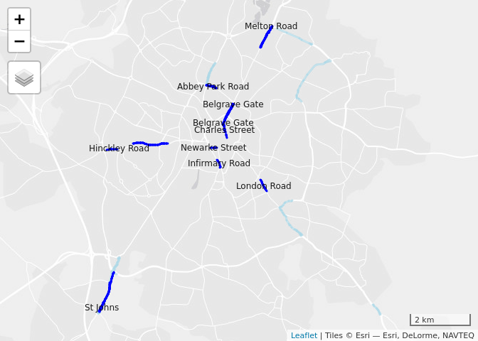
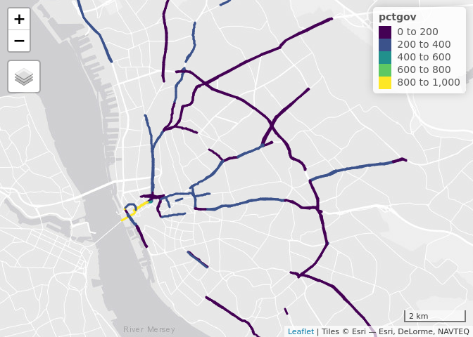

Data analysis to support temporary cycleways
================

  - [Introduction](#introduction)
  - [Method](#method)
  - [Interpreting the results](#interpreting-the-results)
      - [What the maps show](#what-the-maps-show)
  - [London](#london)
  - [Birmingham](#birmingham)
  - [Manchester](#manchester)
  - [Leeds](#leeds)
  - [Liverpool](#liverpool)
  - [Bristol](#bristol)
  - [Leicester](#leicester)
  - [Sheffield](#sheffield)
  - [Newcastle](#newcastle)
  - [Cambridge](#cambridge)

<!-- README.md is generated from README.Rmd. Please edit that file -->

# Introduction

<!-- badges: start -->

<!-- badges: end -->

The goal of this project is to flag roads on which there is

  - high cycling potential
  - road space that could be re-allocated

in the context of increased demand for cycling to keyworker workplaces.

It is based on an analysis of data generated for Department for
Transport funded projects the Propensity to Cycle Tool (PCT) and the
Cycling Infrastructure Prioritisation Toolkit (CyIPT).

As an initial analysis, to elicit feedback on the methods and
preliminary results, we have focused on a sample of major cities. We
hope this can be further developed and expanded in due course to provide
nationwide coverage.

We chose the top 5 cities in terms of absolute long-term cycling
potential (London, Birmingham, Manchester, Leeds, Liverpool) plus an
additional 5 cities that have active advocacy groups (Newcastle,
Sheffield, Cambridge, Bristol, Leicester). Estimates of current and
potential numbers of commuters who could cycle to work in these cities
are presented in the table below.
<!-- We did this by analysing data from the PCT project and selecting the top 10 cities in terms of long term cycling potential, plus Sheffield and Cambridge, : -->

| name       |     all | bicycle | dutch\_slc |
| :--------- | ------: | ------: | ---------: |
| London     | 3634280 |  155694 |     759755 |
| Birmingham |  392517 |    6476 |      76169 |
| Manchester |  199011 |    8447 |      54419 |
| Leeds      |  326680 |    6250 |      51046 |
| Liverpool  |  185117 |    3978 |      48306 |
| Bristol    |  192881 |   15797 |      37909 |
| Leicester  |  128501 |    4999 |      35253 |
| Sheffield  |  226477 |    4276 |      25973 |
| Newcastle  |  111295 |    3229 |      24792 |
| Cambridge  |   53295 |   17313 |      20056 |

Selection of 10 cities in England with high cycling potential or active
adovcacy groups. ‘All’ represents all commuters in the 2011 Census,
‘bicycle’ represents the number who cycled to work and ‘dutch\_slc’
the number who could cycle to work under a ‘Go Dutch’ scenario of
cycling uptake.

The geographic distribution of these cities is shown in the map below:

<!-- -->

These cities represent around 1/4 of the population of England. Welsh
and Scottish cities with high cycling potential such as Cardiff and
Edinbugh were not included in the analysis because the CyIPT does not
currently have data outside of England, although we could extend the
methods to cover all UK cities at some point.

# Method

To identify streets that may be strong candidates for the provision of
temporary or ‘pop-up’ cycleways, building on data from the CyIPT and PCT
projects, three filtering methods were used:

  - Number of lanes: roads with more than 1 lane in either direction
    were identified
  - Cycling potential: only roads with high cycling potential, of 100 or
    more in the long-term Government Target scenario, were selected
  - Length of road: only road sections at least 100m long were included
    in the analysis

From the resulting selections we then identified the ‘top 10’ routes in
each city based on cycling potential. In most cities, only road sections
longer than a threshold of 200-300m were considered for entry to this
‘top 10’ list.

More criteria such as road width and proximity to key services such as
hospitals could be added at a later date. A final stage involved
manually removing road sections such as roads on which there is already
good quality dedicated infrastructure and roundabouts. This final stage
could be automated in future work.

The cycling potential of the ‘top 10’ streets is presented in terms of
the ‘Government Target’ scenario, which represents a doubling in cycling
compared with 2011 levels. London is close to meeting this target
already.

# Interpreting the results

The results are not a definitive list of places where pop-up cycleways
should be prioritised but a ‘starter for 10’ highlighting roads that
good candidates for ‘pop-up’ active transport infrastructure through
reallocation of road space, as has happened in [Park Lane in
London](https://www.forbes.com/sites/carltonreid/2020/05/06/pop-up-cycleway-for-park-lane-as-tenfold-increase-in-cycling-predicted-for-london/#48aad0705b1e).
The results highlight roads that have cycling potential and at least one
spare lane, meaning a 2 lanes in one direction. There will be many road
sections that would benefit from interventions not shown in the maps
below: for example roads with only one lane in each direction could be
made oneway temporarily, creating a spare lane for cycleways or extra
pavement width. Prevent through-flow in residential areas, as is
happening in
[Lewisham](https://853.london/2020/05/05/lewisham-council-asks-which-streets-it-should-open-up-to-walkers-and-cyclists/)
is another option that can complement road reallocation.

<!-- We filtered-out roads with low levels of cycling potential and focus only on roads that have at least one 'spare lane', defined as having more than 1 lane in either direction. -->

<!-- Such roads that could be converted into 'liveable streets' by preventing through traffic have not been considered at this stage. -->

Evidence supporting other types of interventions, for example where
there is high demand for access to key workplaces but little space for
walking and cycling, could be an aim of future work.

## What the maps show

The results below show all roads with a ‘spare lane’ in **light blue**
based on the three criteria listed above (lanes, potential and length).
The top 10 roads in terms of cycling potential are shown in **dark
blue**. Cycling potential refers to the number of commuters who would
cycle along the road (either to or from work) under the Government
Target based on data from the Department for Transport funded Propensity
to Cycle Tool (see [www.pct.bike](https://www.pct.bike/)).

# London

<!-- -->

| name                 | ref   | road\_type | cycling\_potential | length\_m |
| :------------------- | :---- | :--------- | -----------------: | --------: |
| Kennington Park Road | A3    | trunk      |               3255 |       925 |
| Brixton Road         | A23   | trunk      |               2606 |      2849 |
| Stoke Newington Road | A10   | trunk      |               2501 |       590 |
| Camberwell New Road  | A202  | trunk      |               2420 |      1630 |
| Waterloo Bridge      | A301  | primary    |               2398 |      1166 |
| Theobalds Road       | A401  | primary    |               2267 |       565 |
| Old Street           | A5201 | primary    |               2012 |       505 |
| West Cromwell Road   | A4    | trunk      |               1971 |      1024 |
| Jamaica Road         | A200  | primary    |               1926 |      1361 |
| Tower Bridge Road    | A100  | trunk      |               1899 |      1191 |

# Birmingham

<!-- -->

| name                     | ref   | road\_type | cycling\_potential | length\_m |
| :----------------------- | :---- | :--------- | -----------------: | --------: |
| Pershore Road            | A441  | primary    |                618 |      3672 |
| Hagley Road              | A456  | trunk      |                504 |      4229 |
| Bristol Street           | A38   | trunk      |                474 |      1185 |
| Suffolk Street Queensway | A38   | trunk      |                410 |      1595 |
| Queensway                | A38   | trunk      |                332 |      2138 |
| Belgrave Middleway       | A4540 | trunk      |                306 |      2225 |
| High Street              | A34   | trunk      |                301 |      1068 |
| Chad Road                | B4124 | secondary  |                284 |       322 |
| Gravelly Hill North      | A5127 | primary    |                261 |       592 |
| Aldridge Road            | A453  | primary    |                260 |      2674 |

# Manchester

<!-- -->

| name                    | ref   | road\_type | cycling\_potential | length\_m |
| :---------------------- | :---- | :--------- | -----------------: | --------: |
| Anson Road              | A34   | trunk      |                773 |       729 |
| Upper Brook Street      | A34   | trunk      |                637 |      1727 |
| Birchfields Road        | A34   | trunk      |                631 |      1424 |
| Princess Street         | A34   | primary    |                553 |       446 |
| Stockport Road          | A6    | trunk      |                522 |      4991 |
| Great Ducie Street      | A56   | trunk      |                516 |       824 |
| Devonshire Street North | A665  | trunk      |                474 |       373 |
| Edge Lane               | A5145 | trunk      |                471 |      1814 |
| Regent Road             | A57   | trunk      |                451 |      2701 |
| Princess Road           | A5103 | trunk      |                438 |     12230 |

# Leeds

<!-- -->

| name             | ref  | road\_type | cycling\_potential | length\_m |
| :--------------- | :--- | :--------- | -----------------: | --------: |
| Willow Road      |      | tertiary   |                466 |       316 |
| Woodhouse Lane   | A660 | trunk      |                368 |      2373 |
| Blenheim Walk    | A660 | trunk      |                340 |       347 |
| Otley Road       | A660 | trunk      |                325 |      7273 |
| Swinegate        |      | secondary  |                318 |       309 |
| Crown Point Road | A653 | primary    |                316 |       652 |
| Kirkstall Road   | A65  | primary    |                261 |      3774 |
| Clay Pit Lane    | A58  | trunk      |                257 |      2163 |
| The Headrow      |      | tertiary   |                250 |       440 |
| Hunslet Road     | A639 | primary    |                221 |      1860 |

# Liverpool

<!-- -->

| name           | ref   | road\_type | cycling\_potential | length\_m |
| :------------- | :---- | :--------- | -----------------: | --------: |
| Dale Street    | A57   | trunk      |                828 |       474 |
| Princes Road   | B5175 | secondary  |                399 |       797 |
| Scotland Road  | A59   | trunk      |                342 |      2847 |
| Low Hill       | A580  | trunk      |                306 |      1174 |
| London Road    | A57   | primary    |                305 |       220 |
| Byrom Street   | A59   | trunk      |                293 |       922 |
| Longmoor Lane  | A506  | primary    |                284 |       369 |
| Edge Lane      | A5047 | trunk      |                280 |      5270 |
| Brownlow Hill  |       | tertiary   |                262 |       790 |
| Erskine Street | A580  | trunk      |                253 |       469 |

# Bristol

<!-- -->

| name              | ref   | road\_type   | cycling\_potential | length\_m |
| :---------------- | :---- | :----------- | -----------------: | --------: |
| Temple Way        | A4044 | trunk        |                432 |       708 |
| Bond Street       | A4044 | trunk        |                268 |       442 |
| Bond Street South | A4044 | trunk        |                246 |      1039 |
| Bedminster Parade | A38   | trunk        |                234 |       401 |
| Bath Road         | A4    | trunk        |                191 |      6227 |
| Coronation Road   | A370  | trunk        |                179 |      2033 |
| Clarence Road     | A370  | trunk        |                124 |       666 |
| Malago Road       | A38   | trunk        |                123 |       478 |
| Hotwell Road      | A4    | primary      |                117 |       533 |
| East Street       |       | unclassified |                111 |       392 |

# Leicester

<!-- -->

| name            | ref   | road\_type   | cycling\_potential | length\_m |
| :-------------- | :---- | :----------- | -----------------: | --------: |
| Infirmary Road  | A594  | primary      |                361 |       282 |
| Charles Street  |       | unclassified |                326 |       527 |
| London Road     | A6    | primary      |                321 |       437 |
| Newarke Street  | A594  | primary      |                220 |       217 |
| Hinckley Road   | A47   | primary      |                211 |      1506 |
| Abbey Park Road |       | tertiary     |                184 |       645 |
| St Johns        | B4114 | secondary    |                175 |      2403 |
| Melton Road     | A607  | primary      |                168 |      1571 |
| Belgrave Gate   |       | tertiary     |                160 |       569 |
| Belgrave Gate   | A607  | primary      |                156 |       822 |

# Sheffield

<!-- -->

| name              | ref   | road\_type | cycling\_potential | length\_m |
| :---------------- | :---- | :--------- | -----------------: | --------: |
| London Road       | A61   | trunk      |                466 |       530 |
| Ecclesall Road    | A625  | primary    |                416 |      1495 |
| Shoreham Street   | A61   | trunk      |                348 |       426 |
| Moore Street      | A61   | trunk      |                280 |       208 |
| Arundel Gate      |       | tertiary   |                262 |       693 |
| Chesterfield Road | A61   | trunk      |                228 |      2705 |
| Greenland Road    | A6102 | trunk      |                213 |      2301 |
| Meadowhead        | A61   | trunk      |                191 |      1792 |
| Park Square       | A61   | trunk      |                186 |       516 |
| Abbeydale Road    | A621  | primary    |                185 |      2044 |

# Newcastle

<!-- -->

| name                | ref   | road\_type | cycling\_potential | length\_m |
| :------------------ | :---- | :--------- | -----------------: | --------: |
| Coast Road          | A1058 | trunk      |                529 |     17203 |
| Barrack Road        | A189  | primary    |                344 |      1063 |
| Ponteland Road      | A189  | primary    |                314 |       530 |
| Grandstand Road     | A189  | primary    |                234 |       253 |
| Great North Road    | B1318 | secondary  |                214 |       781 |
| Jesmond Road        | A1058 | trunk      |                211 |      1356 |
| Scotswood Bridge    | A695  | primary    |                191 |       281 |
| St James’ Boulevard | A189  | primary    |                169 |      1042 |
| Stamfordham Road    | A167  | primary    |                139 |      1984 |
| Jedburgh Road       | A167  | trunk      |                130 |      5621 |

# Cambridge

<!-- -->

| name                  | ref   | road\_type   | cycling\_potential | length\_m |
| :-------------------- | :---- | :----------- | -----------------: | --------: |
| Saint Andrew’s Street |       | residential  |               2449 |       164 |
| Hobson Street         |       | residential  |               2393 |       216 |
| Bridge Street         |       | residential  |                878 |       194 |
| Elizabeth Way         | A1134 | primary      |                860 |       812 |
| Emmanuel Street       |       | residential  |                586 |       151 |
| Chesterton Road       | A1134 | primary      |                530 |       194 |
| Milton Road           | A1309 | primary      |                364 |      1730 |
| Victoria Road         | A1134 | primary      |                312 |       114 |
| Milton Road           | A1134 | primary      |                192 |       441 |
| Station Place         |       | unclassified |                132 |       237 |
