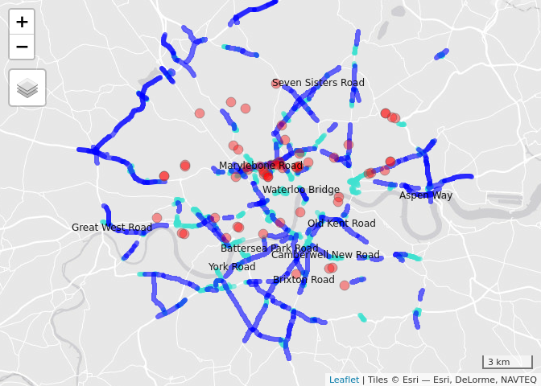
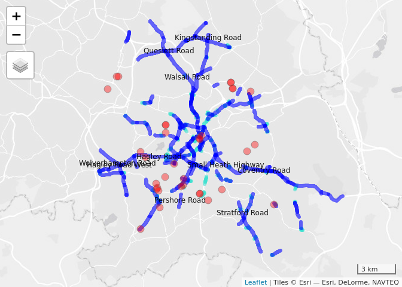
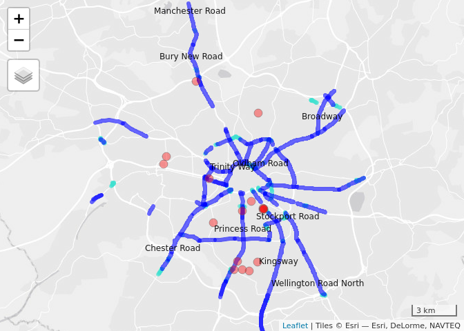
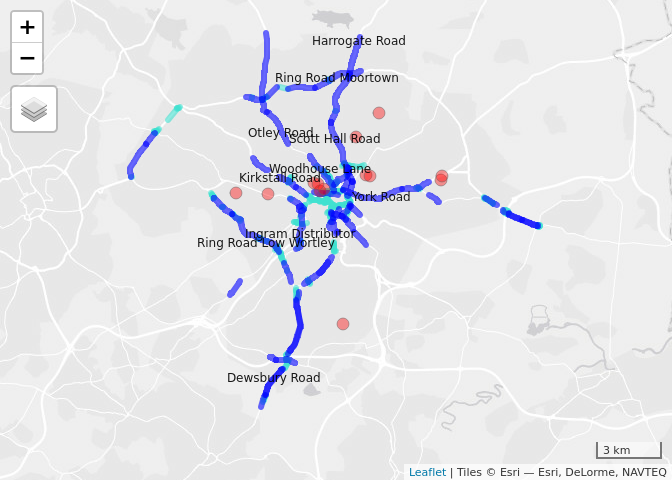
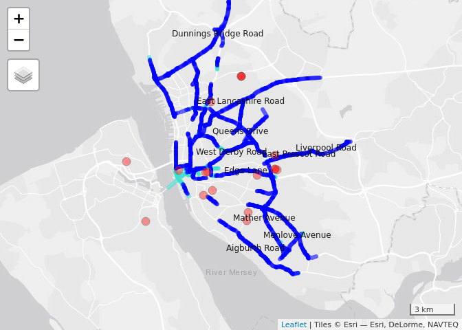
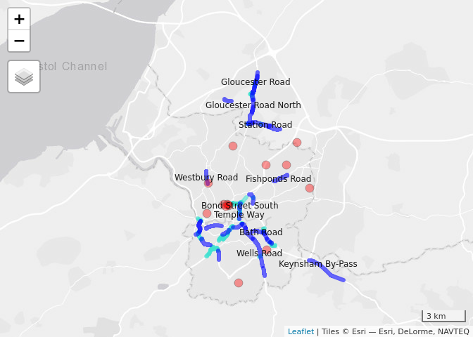
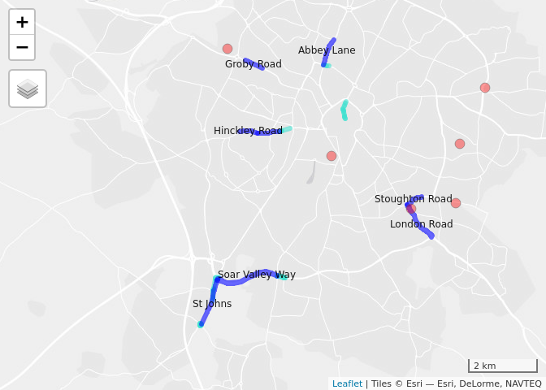
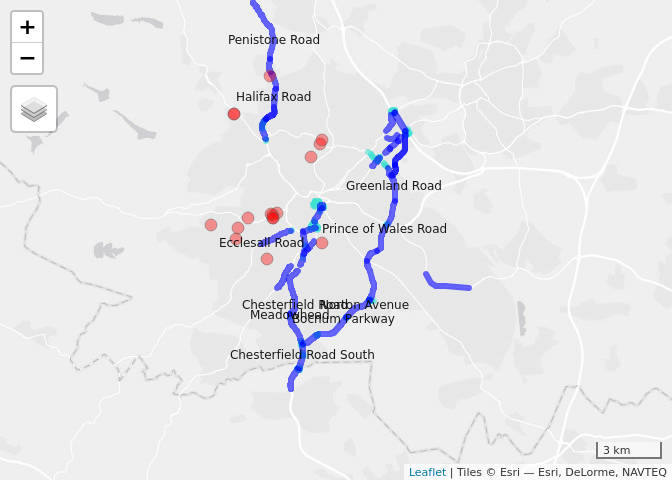
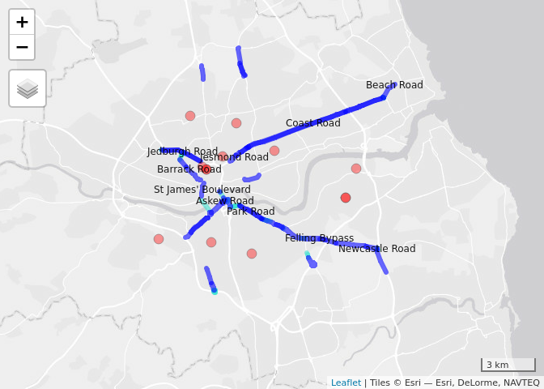
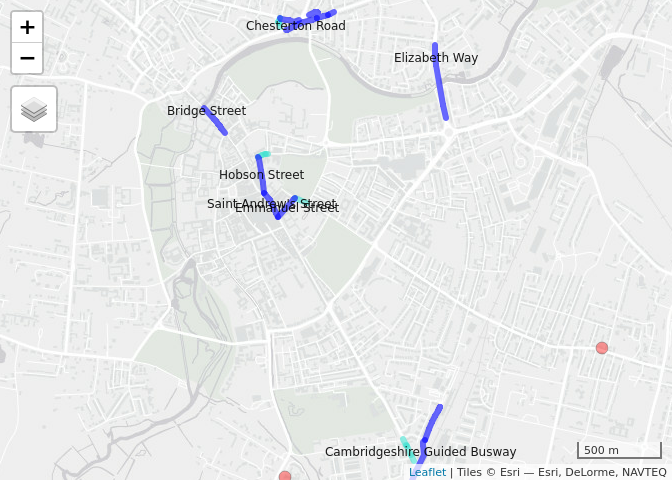

Data analysis to support temporary cycleways
================

  - [Introduction](#introduction)
  - [Method](#method)
  - [Interpreting the results](#interpreting-the-results)
      - [What the maps show](#what-the-maps-show)
  - [London](#london)
  - [Birmingham](#birmingham)
  - [Manchester](#manchester)
  - [Leeds](#leeds)
  - [Liverpool](#liverpool)
  - [Bristol](#bristol)
  - [Leicester](#leicester)
  - [Sheffield](#sheffield)
  - [Newcastle](#newcastle)
  - [Cambridge](#cambridge)

<!-- README.md is generated from README.Rmd. Please edit that file -->

# Introduction

<!-- badges: start -->

<!-- badges: end -->

The goal of this project is to flag roads on which there is

  - high cycling potential
  - road space that could be re-allocated

in the context of increased demand for cycling to key worker workplaces.

See this [pre-print paper](https://osf.io/7wjb6) for a generalised
summary of the methods. This document describes the work in the context
of UK planning priorities.

It is based on an analysis of data generated for Department for
Transport funded projects the Propensity to Cycle Tool (PCT) and the
Cycling Infrastructure Prioritisation Toolkit (CyIPT).

As an initial analysis, to elicit feedback on the methods and
preliminary results, we have focused on a sample of major cities. We
hope this can be further developed and expanded in due course to provide
nationwide coverage.

We chose the top 5 cities in terms of absolute long-term cycling
potential (London, Birmingham, Manchester, Leeds, Liverpool) plus an
additional 5 cities that have active advocacy groups (Newcastle,
Sheffield, Cambridge, Bristol, Leicester). Estimates of current and
potential numbers of commuters who could cycle to work in these cities
are presented in the table below.
<!-- We did this by analysing data from the PCT project and selecting the top 10 cities in terms of long term cycling potential, plus Sheffield and Cambridge, : -->

| name       |     all | bicycle | dutch\_slc |
| :--------- | ------: | ------: | ---------: |
| London     | 3634280 |  155694 |     759755 |
| Birmingham |  392517 |    6476 |      76169 |
| Manchester |  199011 |    8447 |      54419 |
| Leeds      |  326680 |    6250 |      51046 |
| Liverpool  |  185117 |    3978 |      48306 |
| Bristol    |  192881 |   15797 |      37909 |
| Leicester  |  128501 |    4999 |      35253 |
| Sheffield  |  226477 |    4276 |      25973 |
| Newcastle  |  111295 |    3229 |      24792 |
| Cambridge  |   53295 |   17313 |      20056 |

Selection of 10 cities in England with high cycling potential or active
adovcacy groups. ‘All’ represents all commuters in the 2011 Census,
‘bicycle’ represents the number who cycled to work and ‘dutch\_slc’
the number who could cycle to work under a ‘Go Dutch’ scenario of
cycling uptake.

The geographic distribution of these cities is shown in the map below:

<!-- -->

These cities represent around 1/4 of the population of England. Welsh
and Scottish cities with high cycling potential such as Cardiff and
Edinburgh were not included in the analysis because the CyIPT does not
currently have data outside of England, although we could extend the
methods to cover all UK cities at some point.

# Method

To identify streets that may be strong candidates for the provision of
temporary or ‘pop-up’ cycleways, building on data from the CyIPT and PCT
projects, three filtering methods were used:

  - Number of lanes: roads with more than 1 lane in either direction
    were identified
  - Cycling potential: only roads with high cycling potential, of 100 or
    more in the long-term Government Target scenario, were selected
  - Length of road: only road sections at least 100m long were included
    in the analysis

From the resulting selections we then identified the ‘top 10’ routes in
each city based on cycling potential. In most cities, only road sections
longer than a threshold of 200-300m were considered for entry to this
‘top 10’ list.

More criteria such as road width and proximity to key services such as
hospitals could be added at a later date. A final stage involved
manually removing road sections such as roads on which there is already
good quality dedicated infrastructure and roundabouts. This final stage
could be automated in future work.

The cycling potential of the top 10 streets is calculated based on the
‘Government Target’ scenario in the Propensity to Cycle Tool, which
represents a doubling in cycling compared with 2011 levels. London is
close to meeting this target already.

# Interpreting the results

The results are not a definitive list of places where pop-up cycleways
should be prioritised but a ‘starter for 10’ highlighting roads that may
be good candidates for ‘pop-up’ active transport infrastructure. There
are many types of pop-up infrastructure, but focus of this project is
through reallocation lanes of traffic, as planned for [Park Lane and
other wide roads in
London](https://www.forbes.com/sites/carltonreid/2020/05/06/pop-up-cycleway-for-park-lane-as-tenfold-increase-in-cycling-predicted-for-london/#48aad0705b1e).
<!-- It seems this scheme is not in operation yet from https://www.tfljamcams.net/ -->

The results highlight roads that have cycling potential and at least one
spare lane, meaning a 2 lanes in one direction. There will be many road
sections that would benefit from interventions not shown in the maps
below: roads with only one lane in each direction could be made oneway
temporarily, creating a spare lane for cycleways or extra pavement
width. Preventing through-flow in residential areas, as is happening in
[Lewisham](https://853.london/2020/05/05/lewisham-council-asks-which-streets-it-should-open-up-to-walkers-and-cyclists/)
and [Salford City
Council](https://salfordliveablestreets.commonplace.is/) is another
option that can complement road reallocation.

<!-- We filtered-out roads with low levels of cycling potential and focus only on roads that have at least one 'spare lane', defined as having more than 1 lane in either direction. -->

<!-- Such roads that could be converted into 'liveable streets' by preventing through traffic have not been considered at this stage. -->

Evidence supporting other types of interventions, for example where
there is high demand for access to key workplaces but little space for
walking and cycling, could be an aim of future work.

## What the maps show

The results below show all roads with a ‘spare lane’ in **light blue**
based on the three criteria listed above (lanes, potential and length).
The top 10 roads in terms of cycling potential are shown in **dark
blue**. Cycling potential refers to the number of commuters who would
cycle along the road (either to or from work) under the Government
Target based on data from the Department for Transport funded Propensity
to Cycle Tool (see [www.pct.bike](https://www.pct.bike/)).

# London

<!-- -->

| name                | length | cycling\_potential | km\_cycled |
| :------------------ | -----: | -----------------: | ---------: |
| Brixton Road        |   2396 |               1619 |       3879 |
| Camberwell New Road |   1190 |               2397 |       2854 |
| Great West Road     |   4129 |                601 |       2481 |
| Seven Sisters Road  |   3802 |                578 |       2198 |
| Old Kent Road       |   1943 |               1119 |       2174 |
| Aspen Way           |   3299 |                649 |       2141 |
| Waterloo Bridge     |    661 |               3235 |       2139 |
| Marylebone Road     |   3263 |                629 |       2052 |
| York Road           |   1684 |               1136 |       1913 |
| Battersea Park Road |   2468 |                750 |       1851 |

The top 10 candidate roads for space reallocation for pop-up active
transport infrastructure according to methods developed for the project.

See [london.html](https://cyipt.github.io/popupCycleways/london.html)
for the interactive version of the map above.

# Birmingham

<!-- -->

| name                | length | cycling\_potential | km\_cycled |
| :------------------ | -----: | -----------------: | ---------: |
| Walsall Road        |   7338 |                135 |        991 |
| Small Heath Highway |   6047 |                162 |        980 |
| Stratford Road      |   7080 |                130 |        920 |
| Pershore Road       |   1040 |                784 |        815 |
| Hagley Road West    |   5013 |                162 |        812 |
| Kingstanding Road   |   5894 |                135 |        796 |
| Coventry Road       |   4753 |                162 |        770 |
| Queslett Road       |   5429 |                135 |        733 |
| Hagley Road         |   4225 |                162 |        684 |
| Wolverhampton Road  |   3795 |                162 |        615 |

The top 10 candidate roads for space reallocation for pop-up active
transport infrastructure according to methods developed for the project.

See
[birmingham.html](https://cyipt.github.io/popupCycleways/birmingham.html)
for the interactive version of the map above.

# Manchester

<!-- -->

| name                  | length | cycling\_potential | km\_cycled |
| :-------------------- | -----: | -----------------: | ---------: |
| Kingsway              |  11095 |                256 |       2840 |
| Princess Road         |   7319 |                370 |       2708 |
| Chester Road          |   5405 |                374 |       2021 |
| Oldham Road           |   6853 |                249 |       1706 |
| Manchester Road       |   2768 |                510 |       1412 |
| Wellington Road North |   3246 |                423 |       1373 |
| Bury New Road         |   2592 |                510 |       1322 |
| Broadway              |   5802 |                192 |       1114 |
| Stockport Road        |   2048 |                496 |       1016 |
| Trinity Way           |   4227 |                229 |        968 |

The top 10 candidate roads for space reallocation for pop-up active
transport infrastructure according to methods developed for the project.

See
[manchester.html](https://cyipt.github.io/popupCycleways/manchester.html)
for the interactive version of the map above.

# Leeds

<!-- -->

| name                  | length | cycling\_potential | km\_cycled |
| :-------------------- | -----: | -----------------: | ---------: |
| Otley Road            |   1766 |                758 |       1339 |
| Scott Hall Road       |   8723 |                123 |       1073 |
| Ring Road Low Wortley |   5177 |                151 |        782 |
| Dewsbury Road         |   4073 |                178 |        725 |
| Woodhouse Lane        |   2206 |                295 |        651 |
| Kirkstall Road        |   1557 |                341 |        531 |
| Ring Road Moortown    |   4152 |                123 |        511 |
| York Road             |   1883 |                242 |        456 |
| Harrogate Road        |   3254 |                123 |        400 |
| Ingram Distributor    |   2771 |                137 |        380 |

The top 10 candidate roads for space reallocation for pop-up active
transport infrastructure according to methods developed for the project.

See [leeds.html](https://cyipt.github.io/popupCycleways/leeds.html) for
the interactive version of the map above.

# Liverpool

<!-- -->

| name                 | length | cycling\_potential | km\_cycled |
| :------------------- | -----: | -----------------: | ---------: |
| Queens Drive         |  11755 |                149 |       1751 |
| East Prescot Road    |   5519 |                237 |       1308 |
| Liverpool Road       |   5306 |                237 |       1258 |
| East Lancashire Road |   7887 |                140 |       1104 |
| Menlove Avenue       |   6332 |                149 |        943 |
| Mather Avenue        |   5425 |                149 |        808 |
| Aigburth Road        |   5315 |                149 |        792 |
| Edge Lane            |   5268 |                149 |        785 |
| Dunnings Bridge Road |   4828 |                143 |        690 |
| West Derby Road      |   4254 |                149 |        634 |

The top 10 candidate roads for space reallocation for pop-up active
transport infrastructure according to methods developed for the project.

See
[liverpool.html](https://cyipt.github.io/popupCycleways/liverpool.html)
for the interactive version of the map above.

# Bristol

<!-- -->

| name                  | length | cycling\_potential | km\_cycled |
| :-------------------- | -----: | -----------------: | ---------: |
| Gloucester Road       |   2269 |                340 |        771 |
| Fishponds Road        |   1020 |                745 |        760 |
| Gloucester Road North |   1389 |                340 |        472 |
| Keynsham By-Pass      |   2719 |                142 |        386 |
| Wells Road            |   2019 |                163 |        329 |
| Station Road          |   1724 |                164 |        283 |
| Bath Road             |   1400 |                200 |        280 |
| Bond Street South     |    722 |                359 |        259 |
| Westbury Road         |    894 |                244 |        218 |
| Temple Way            |    603 |                359 |        216 |

The top 10 candidate roads for space reallocation for pop-up active
transport infrastructure according to methods developed for the project.

See [bristol.html](https://cyipt.github.io/popupCycleways/bristol.html)
for the interactive version of the map above.

# Leicester

<!-- -->

| name            | length | cycling\_potential | km\_cycled |
| :-------------- | -----: | -----------------: | ---------: |
| Soar Valley Way |   3590 |                109 |        391 |
| London Road     |   1392 |                195 |        271 |
| St Johns        |   1393 |                109 |        152 |
| Hinckley Road   |    509 |                295 |        150 |
| Abbey Lane      |    769 |                149 |        115 |
| Stoughton Road  |    508 |                195 |         99 |
| Groby Road      |    542 |                124 |         67 |

The top 10 candidate roads for space reallocation for pop-up active
transport infrastructure according to methods developed for the project.

See
[leicester.html](https://cyipt.github.io/popupCycleways/leicester.html)
for the interactive version of the map above.

# Sheffield

<!-- -->

| name                    | length | cycling\_potential | km\_cycled |
| :---------------------- | -----: | -----------------: | ---------: |
| Bochum Parkway          |   4466 |                161 |        719 |
| Penistone Road          |   2903 |                230 |        668 |
| Chesterfield Road       |   2564 |                232 |        595 |
| Ecclesall Road          |   1494 |                379 |        566 |
| Norton Avenue           |   2709 |                161 |        436 |
| Prince of Wales Road    |   2409 |                178 |        429 |
| Greenland Road          |   2231 |                178 |        397 |
| Meadowhead              |   1565 |                232 |        363 |
| Chesterfield Road South |   2179 |                161 |        351 |
| Halifax Road            |   2426 |                137 |        332 |

The top 10 candidate roads for space reallocation for pop-up active
transport infrastructure according to methods developed for the project.

See
[sheffield.html](https://cyipt.github.io/popupCycleways/sheffield.html)
for the interactive version of the map above.

# Newcastle

<!-- -->

| name                | length | cycling\_potential | km\_cycled |
| :------------------ | -----: | -----------------: | ---------: |
| Coast Road          |   5691 |                691 |       3933 |
| Felling Bypass      |   5111 |                314 |       1605 |
| Newcastle Road      |   4489 |                296 |       1329 |
| Park Road           |   1418 |                793 |       1124 |
| Askew Road          |   2092 |                266 |        556 |
| Jedburgh Road       |   2202 |                235 |        518 |
| Jesmond Road        |    841 |                615 |        517 |
| Beach Road          |   1000 |                460 |        460 |
| Barrack Road        |   1062 |                349 |        371 |
| St James’ Boulevard |    709 |                268 |        190 |

The top 10 candidate roads for space reallocation for pop-up active
transport infrastructure according to methods developed for the project.

See
[newcastle.html](https://cyipt.github.io/popupCycleways/newcastle.html)
for the interactive version of the map above.

# Cambridge

<!-- -->

| name                         | length | cycling\_potential | km\_cycled |
| :--------------------------- | -----: | -----------------: | ---------: |
| Elizabeth Way                |    435 |               1256 |        546 |
| Milton Road                  |    578 |                736 |        426 |
| Hobson Street                |    215 |               1763 |        380 |
| Saint Andrew’s Street        |    164 |               1763 |        289 |
| Emmanuel Street              |    150 |               1763 |        265 |
| Bridge Street                |    194 |                889 |        173 |
| Chesterton Road              |    233 |                623 |        145 |
| Longstanton Road             |    491 |                135 |         66 |
| Newmarket Road               |    239 |                195 |         47 |
| Cambridgeshire Guided Busway |    273 |                155 |         42 |

The top 10 candidate roads for space reallocation for pop-up active
transport infrastructure according to methods developed for the project.

See
[cambridge.html](https://cyipt.github.io/popupCycleways/cambridge.html)
for the interactive version of the map above.
