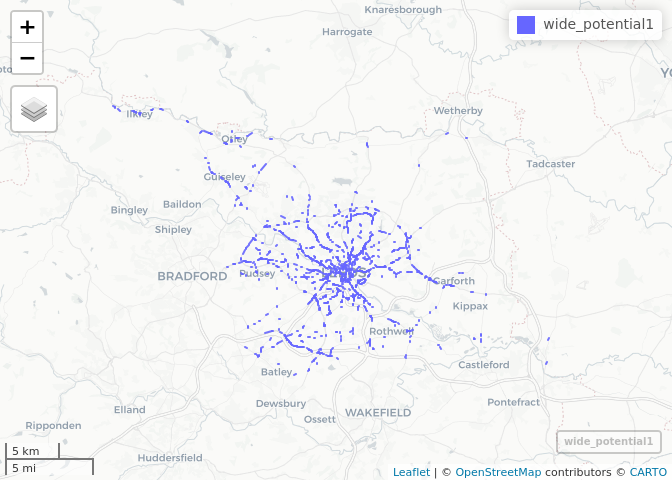
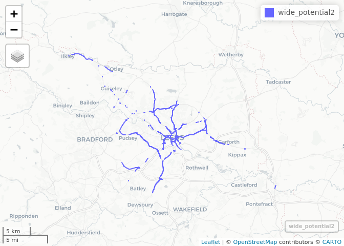
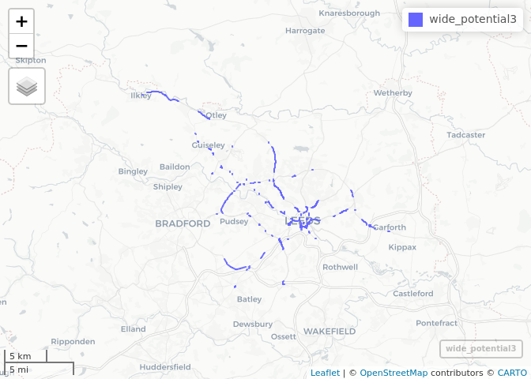
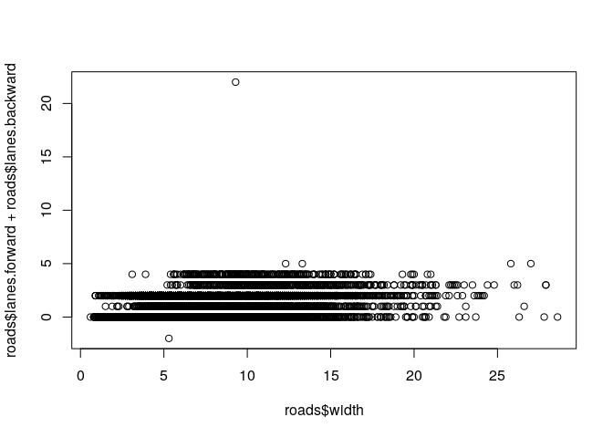

<!-- README.md is generated from README.Rmd. Please edit that file -->

# tempCycleways

<!-- badges: start -->

<!-- badges: end -->

The goal of this project is to flag roads on which there is

  - high cycling potential
  - road space that could be re-allocated

in the context of increased for demand for cycling to keyworker
workplaces.

It is based on an analysis of data generated for the Department for
Transport funded projects the Propensity to Cycle Tool (PCT) and the
Cycling Infrastructure Prioritisation Toolkit (CyIPT).

``` r
# Aim: identify wide roads that have high cycling potential


# setup -------------------------------------------------------------------

library(tidyverse)
#> ── Attaching packages ──────────────────────────────────────────────── tidyverse 1.3.0.9000 ──
#> ✔ ggplot2 3.3.0     ✔ purrr   0.3.4
#> ✔ tibble  3.0.1     ✔ dplyr   0.8.5
#> ✔ tidyr   1.0.2     ✔ stringr 1.4.0
#> ✔ readr   1.3.1     ✔ forcats 0.5.0
#> ── Conflicts ──────────────────────────────────────────────────────── tidyverse_conflicts() ──
#> ✖ dplyr::filter() masks stats::filter()
#> ✖ dplyr::lag()    masks stats::lag()
library(sf)
#> Linking to GEOS 3.8.0, GDAL 3.0.4, PROJ 7.0.0
library(tmap)
tmap_mode("view")
#> tmap mode set to interactive viewing

# input data --------------------------------------------------------------

up = "https://github.com/cyipt/cyipt-bigdata/raw/master/osm-prep/Leeds/osm-lines.Rds"
roads = readRDS(url(up))
names(roads)
#>  [1] "osm_id"             "name"               "ref"               
#>  [4] "highway"            "junction"           "roadtype"          
#>  [7] "onewaysummary"      "elevation"          "maxspeed"          
#> [10] "segregated"         "sidewalk"           "cycleway.left"     
#> [13] "lanes.psv.forward"  "lanes.forward"      "lanes.backward"    
#> [16] "lanes.psv.backward" "cycleway.right"     "region"            
#> [19] "quietness"          "aadt"               "ncycles"           
#> [22] "id"                 "pct.census"         "pct.gov"           
#> [25] "pct.gen"            "pct.dutch"          "pct.ebike"         
#> [28] "pct.total"          "width"              "widthpath"         
#> [31] "ncollisions"        "bikeCas"            "totalCas"          
#> [34] "totalVeh"           "geometry"
summary(roads$width)
#>    Min. 1st Qu.  Median    Mean 3rd Qu.    Max.    NA's 
#>    0.60    5.30    6.60    6.74    8.00   28.60   25355
wide_potential1 = roads %>% filter(width > 10, pct.dutch > 100)
mapview::mapview(wide_potential1)
```

<!-- -->

``` r
wide_potential2 = roads %>% filter(lanes.forward > 1, pct.dutch > 100)
mapview::mapview(wide_potential2)
```

<!-- -->

``` r
wide_potential3 = roads %>% filter(lanes.forward + lanes.backward > 2, pct.dutch > 100)
mapview::mapview(wide_potential3)
```

<!-- -->

``` r

# relationship between cycling and 2 way ----------------------------------
cor(roads$lanes.forward, roads$pct.census) # there is a small correlation
#> [1] 0.2292919
cor(roads$lanes.forward, roads$pct.dutch) # larger for go dutch scenario
#> [1] 0.2734917
cor(roads$width, roads$pct.census, use = "complete.obs") # also a positive correlation
#> [1] 0.2636899
plot(roads$width, roads$lanes.forward + roads$lanes.backward)
```

<!-- -->

``` r


# out-takes ---------------------------------------------------------------

# u = "https://github.com/cyipt/cyipt-bigdata/raw/master/osm-clean/Leeds/osm-lines.Rds"
# osm_lines = readRDS(url(u))
# names(osm_lines)
# plot(osm_lines) # long time to plot...
# 
# uz = "https://github.com/cyipt/cyipt-bigdata/raw/master/forDB/roads.zip"
# d = file.path(tempdir(), "roads.zip")
# download.file(uz, d)
# r = readr::read_csv(d)
# head(r$elevation)
```

In that case, don’t forget to commit and push the resulting figure
files, so they display on GitHub\!
