<!-- README.md is generated from README.Rmd. Please edit that file -->

# Data analysis to support temporary cycleways

<!-- badges: start -->

<!-- badges: end -->

The goal of this project is to flag roads on which there is

  - high cycling potential
  - road space that could be re-allocated

in the context of increased for demand for cycling to keyworker
workplaces.

It is based on an analysis of data generated for the Department for
Transport funded projects the Propensity to Cycle Tool (PCT) and the
Cycling Infrastructure Prioritisation Toolkit (CyIPT).

To overcome issues associated with doing this at a national level and
elicit feedback on the methods and preliminary results, we ran the
analysis on a sample of cities. We chose the top 5 in terms of absolute
long-term cycling potential (London, Birmingham, Manchester, Leeds,
Liverpool) plus an additional 5 cities that have active advocacy groups
(Newcastle, Sheffield, Cambridge, Bristol, Leicester). Estimates of
current and potential numbers who could cycle to work in these cities is
presented in the table below.
<!-- We did this by analysing data from the PCT project and selecting the top 10 cities in terms of long term cycling potential, plus Sheffield and Cambridge, : -->

| name       |     all | bicycle | dutch\_slc |
| :--------- | ------: | ------: | ---------: |
| London     | 3634280 |  155694 |     759755 |
| Birmingham |  392517 |    6476 |      76169 |
| Manchester |  199011 |    8447 |      54419 |
| Leeds      |  326680 |    6250 |      51046 |
| Liverpool  |  185117 |    3978 |      48306 |
| Bristol    |  192881 |   15797 |      37909 |
| Leicester  |  128501 |    4999 |      35253 |
| Sheffield  |  226477 |    4276 |      25973 |
| Newcastle  |  111295 |    3229 |      24792 |
| Cambridge  |   53295 |   17313 |      20056 |

Selection of 10 cities in England with high cycling potential or active
adovcacy groups. ‘All’ represents all commuters in the 2011 Census,
‘bicycle’ represents the number who cycled to work and ‘dutch\_slc’
the number who could cycle to work under a ‘Go Dutch’ scenario of
cycling uptake.

The geographic distribution of these cities is shown in the map below:

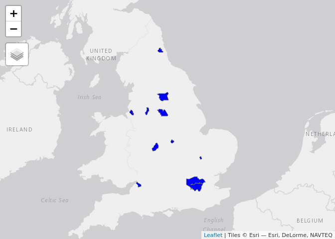<!-- -->

These 12 study cities coincidentally represent almost exactly 1/4 of the
population in England. Welsh and Scottish cities with high cycling
potential such as Cardiff and Edinbugh were not included in the analysis
because the CyIPT does not currently have data outside of England,
although we could extend the methods to cover all UK cities at some
point.

Below we show the results for a selection of cities, with cycling
potential on the road network visualised under the ‘Government Target’
scenario, which represents a doubling in cycling compared with 2011
levels. London is close to meeting this target already.

We filtered-out roads with low levels of cycling potential and focus
only on roads that have at least one ‘spare lane’, defined as having
more than 1 lane in either direction. Roads that could be made oneway,
or that could be converted into ‘liveable streets’ by preventing through
traffic were not considered.

# London

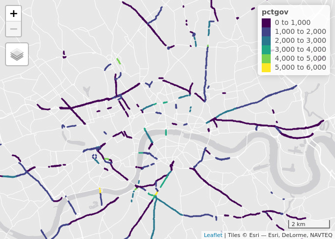<!-- -->

The top 10 roads:

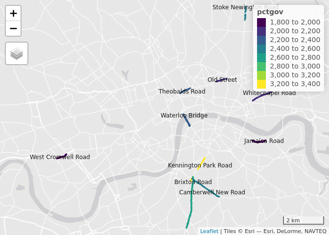<!-- -->

| name                 | ref   | road\_type | cycling\_potential | length\_m |
| :------------------- | :---- | :--------- | -----------------: | --------: |
| Kennington Park Road | A3    | trunk      |               3255 |       925 |
| Brixton Road         | A23   | trunk      |               2606 |      2849 |
| Stoke Newington Road | A10   | trunk      |               2501 |       590 |
| Camberwell New Road  | A202  | trunk      |               2420 |      1630 |
| Waterloo Bridge      | A301  | primary    |               2398 |      1166 |
| Theobalds Road       | A401  | primary    |               2267 |       565 |
| Whitechapel Road     | A11   | trunk      |               2111 |      1560 |
| Old Street           | A5201 | primary    |               2012 |       505 |
| West Cromwell Road   | A4    | trunk      |               1971 |      1024 |
| Jamaica Road         | A200  | primary    |               1926 |      1361 |

# Birmingham

The top 10 roads:

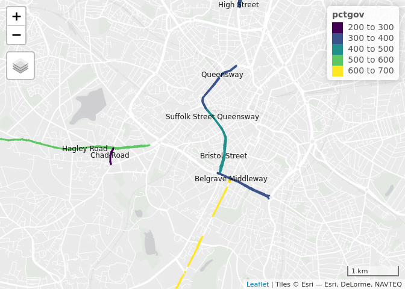<!-- -->

| name                     | ref   | road\_type | cycling\_potential | length\_m |
| :----------------------- | :---- | :--------- | -----------------: | --------: |
| Pershore Road            | A441  | primary    |                618 |      3672 |
| Hagley Road              | A456  | trunk      |                504 |      4229 |
| Bristol Street           | A38   | trunk      |                474 |      1185 |
| Suffolk Street Queensway | A38   | trunk      |                410 |      1595 |
| Queensway                | A38   | trunk      |                332 |      2138 |
| Belgrave Middleway       | A4540 | trunk      |                306 |      2225 |
| High Street              | A34   | trunk      |                301 |      1068 |
| Chad Road                | B4124 | secondary  |                284 |       322 |
| Gravelly Hill North      | A5127 | primary    |                261 |       592 |
| Aldridge Road            | A453  | primary    |                260 |      2674 |

# Manchester

The top 10 roads:

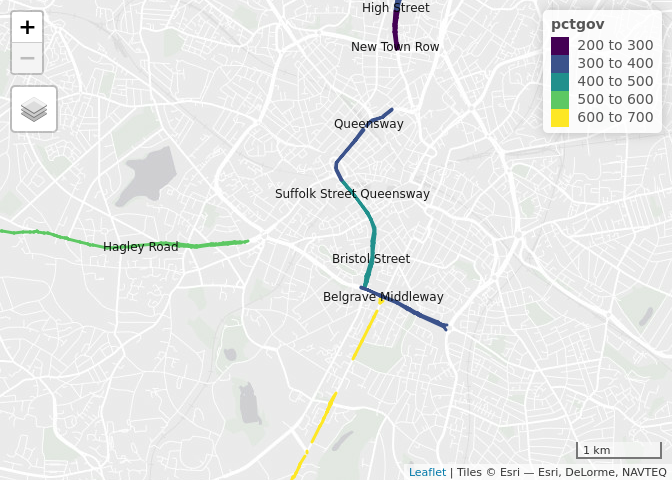<!-- -->

| name                    | ref   | road\_type | cycling\_potential | length\_m |
| :---------------------- | :---- | :--------- | -----------------: | --------: |
| Anson Road              | A34   | trunk      |                773 |       729 |
| Upper Brook Street      | A34   | trunk      |                637 |      1727 |
| Birchfields Road        | A34   | trunk      |                631 |      1424 |
| Princess Street         | A34   | primary    |                553 |       446 |
| Stockport Road          | A6    | trunk      |                522 |      4991 |
| Great Ducie Street      | A56   | trunk      |                516 |       824 |
| Devonshire Street North | A665  | trunk      |                474 |       373 |
| Edge Lane               | A5145 | trunk      |                471 |      1814 |
| Regent Road             | A57   | trunk      |                451 |      2701 |
| Princess Road           | A5103 | trunk      |                438 |     12230 |

# Leeds

The top 10 roads:

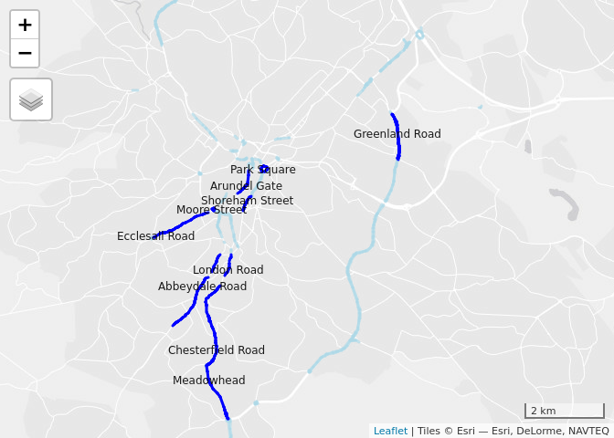<!-- -->

| name              | ref  | road\_type | cycling\_potential | length\_m |
| :---------------- | :--- | :--------- | -----------------: | --------: |
| Wellington Street |      | secondary  |                546 |      1027 |
| Willow Road       |      | tertiary   |                466 |       316 |
| Woodhouse Lane    | A660 | trunk      |                368 |      2373 |
| Blenheim Walk     | A660 | trunk      |                340 |       347 |
| Otley Road        | A660 | trunk      |                325 |      7273 |
| Swinegate         |      | secondary  |                318 |       309 |
| Crown Point Road  | A653 | primary    |                316 |       652 |
| Kirkstall Road    | A65  | primary    |                261 |      3774 |
| Clay Pit Lane     | A58  | trunk      |                257 |      2163 |
| The Headrow       |      | tertiary   |                250 |       440 |

# Liverpool

The top 10 roads:

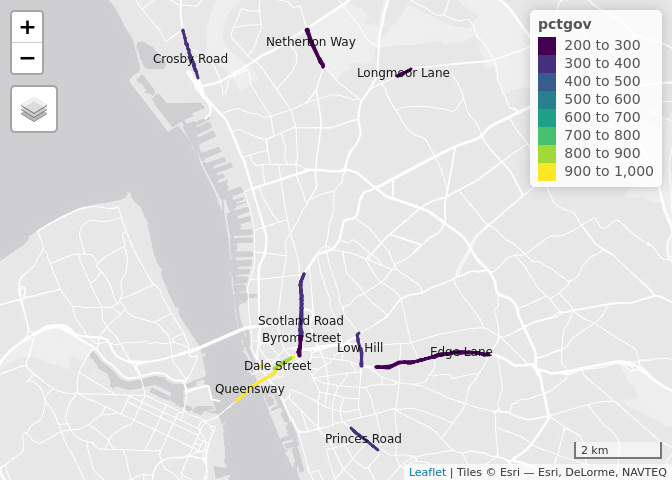<!-- -->

| name            | ref   | road\_type | cycling\_potential | length\_m |
| :-------------- | :---- | :--------- | -----------------: | --------: |
| Dale Street     | A57   | trunk      |                828 |       474 |
| Princes Road    | B5175 | secondary  |                399 |       797 |
| Scotland Road   | A59   | trunk      |                342 |      2847 |
| Low Hill        | A580  | trunk      |                306 |      1174 |
| Byrom Street    | A59   | trunk      |                293 |       922 |
| Longmoor Lane   | A506  | primary    |                284 |       369 |
| Edge Lane       | A5047 | trunk      |                280 |      5270 |
| Brownlow Hill   |       | tertiary   |                262 |       790 |
| Erskine Street  | A580  | trunk      |                253 |       469 |
| West Derby Road | A5049 | trunk      |                250 |      4137 |

# Bristol

The top 10 roads:

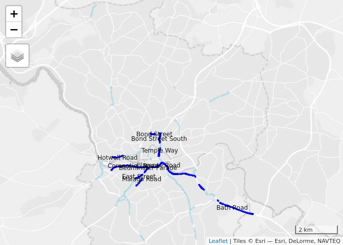<!-- -->

| name              | ref   | road\_type   | cycling\_potential | length\_m |
| :---------------- | :---- | :----------- | -----------------: | --------: |
| Temple Way        | A4044 | trunk        |                432 |       708 |
| Bond Street       | A4044 | trunk        |                268 |       442 |
| Bond Street South | A4044 | trunk        |                246 |      1039 |
| Bedminster Parade | A38   | trunk        |                234 |       401 |
| Bath Road         | A4    | trunk        |                191 |      6227 |
| Coronation Road   | A370  | trunk        |                179 |      2033 |
| Clarence Road     | A370  | trunk        |                124 |       666 |
| Malago Road       | A38   | trunk        |                123 |       478 |
| Hotwell Road      | A4    | primary      |                117 |       533 |
| East Street       |       | unclassified |                111 |       392 |

# Leicester

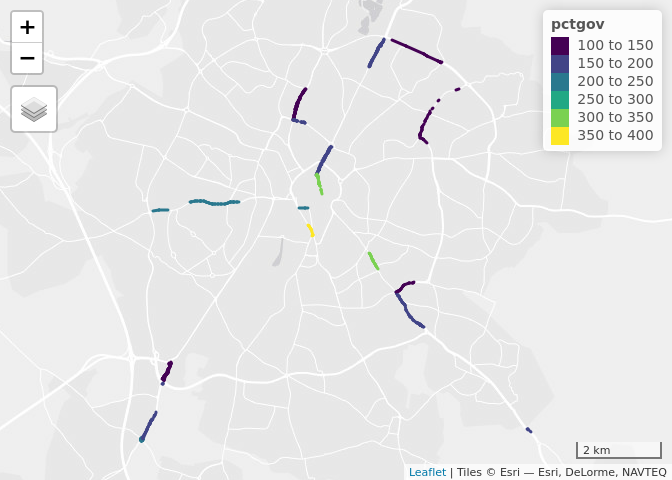<!-- -->

The top 10 roads:

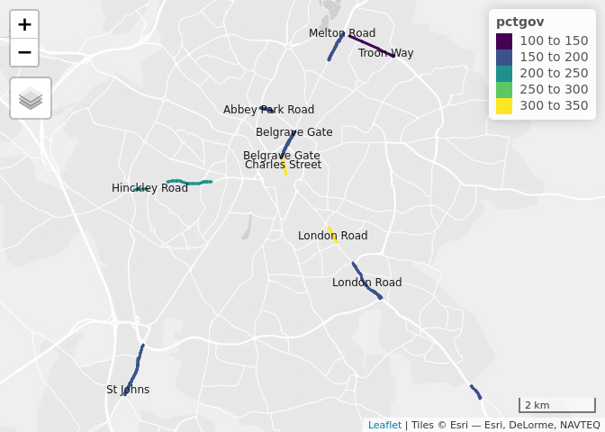<!-- -->

| name            | ref   | road\_type   | cycling\_potential | length\_m |
| :-------------- | :---- | :----------- | -----------------: | --------: |
| Charles Street  |       | unclassified |                326 |       527 |
| London Road     | A6    | primary      |                321 |       437 |
| Hinckley Road   | A47   | primary      |                211 |      1506 |
| Abbey Park Road |       | tertiary     |                184 |       645 |
| St Johns        | B4114 | secondary    |                175 |      2403 |
| Melton Road     | A607  | primary      |                168 |      1571 |
| Belgrave Gate   |       | tertiary     |                160 |       569 |
| Belgrave Gate   | A607  | primary      |                156 |       822 |
| London Road     | A6    | trunk        |                152 |      4927 |
| Troon Way       | A563  | trunk        |                127 |      1306 |

# Sheffield

The top 10 roads:

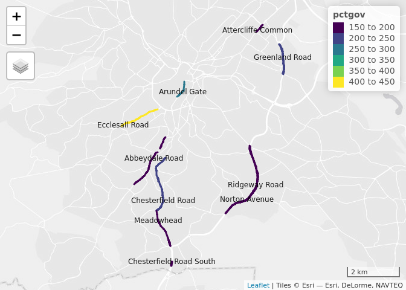<!-- -->

| name                    | ref   | road\_type | cycling\_potential | length\_m |
| :---------------------- | :---- | :--------- | -----------------: | --------: |
| Ecclesall Road          | A625  | primary    |                416 |      1495 |
| Arundel Gate            |       | tertiary   |                262 |       693 |
| Chesterfield Road       | A61   | trunk      |                228 |      2705 |
| Greenland Road          | A6102 | trunk      |                213 |      2301 |
| Meadowhead              | A61   | trunk      |                191 |      1792 |
| Abbeydale Road          | A621  | primary    |                185 |      2044 |
| Chesterfield Road South | A61   | trunk      |                182 |      2180 |
| Norton Avenue           | A6102 | trunk      |                176 |      2711 |
| Attercliffe Common      | A6178 | primary    |                172 |      1301 |
| Ridgeway Road           | A6102 | trunk      |                169 |      3765 |

# Newcastle

The top 10 roads:

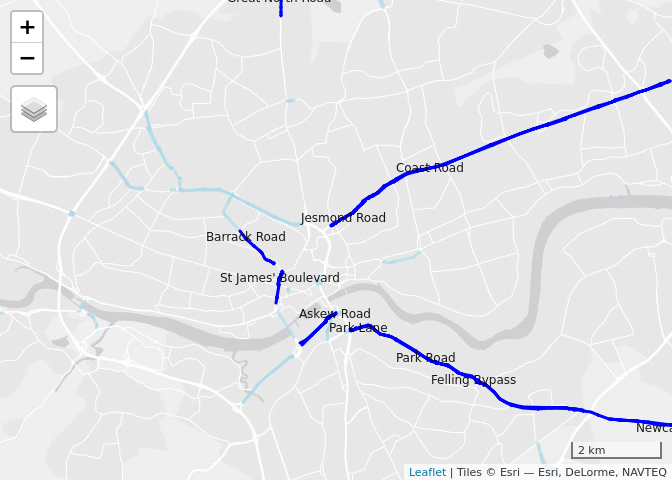<!-- -->

| name                | ref   | road\_type | cycling\_potential | length\_m |
| :------------------ | :---- | :--------- | -----------------: | --------: |
| Park Road           | A184  | trunk      |                666 |      2849 |
| Coast Road          | A1058 | trunk      |                529 |     17203 |
| Felling Bypass      | A184  | trunk      |                490 |      8164 |
| Barrack Road        | A189  | primary    |                344 |      1063 |
| Newcastle Road      | A184  | trunk      |                293 |      4492 |
| Great North Road    | B1318 | secondary  |                214 |       781 |
| Jesmond Road        | A1058 | trunk      |                211 |      1356 |
| St James’ Boulevard | A189  | primary    |                169 |      1042 |
| Askew Road          | A184  | trunk      |                169 |      2131 |
| Park Lane           | A184  | trunk      |                144 |       917 |

# Cambridge

The top 10 roads:

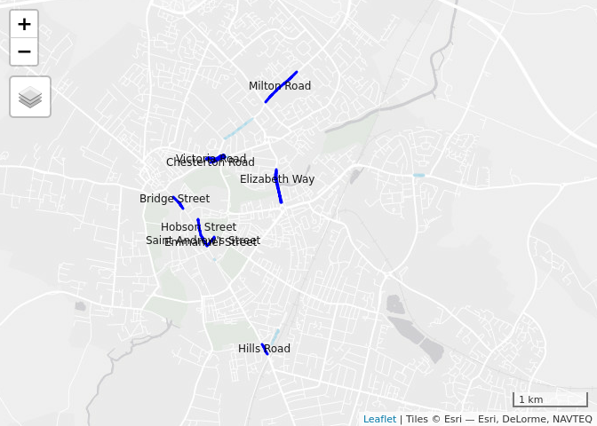<!-- -->

| name                  | ref   | road\_type  | cycling\_potential | length\_m |
| :-------------------- | :---- | :---------- | -----------------: | --------: |
| Saint Andrew’s Street |       | residential |               2449 |       164 |
| Hobson Street         |       | residential |               2393 |       216 |
| Hills Road            | A1307 | primary     |               1662 |       147 |
| Bridge Street         |       | residential |                878 |       194 |
| Elizabeth Way         | A1134 | primary     |                860 |       812 |
|                       | A1134 | primary     |                639 |       187 |
| Emmanuel Street       |       | residential |                586 |       151 |
| Chesterton Road       | A1134 | primary     |                530 |       194 |
| Milton Road           | A1309 | primary     |                364 |      1730 |
| Victoria Road         | A1134 | primary     |                312 |       114 |
