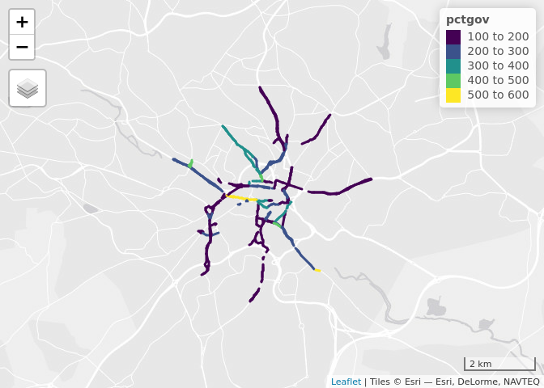
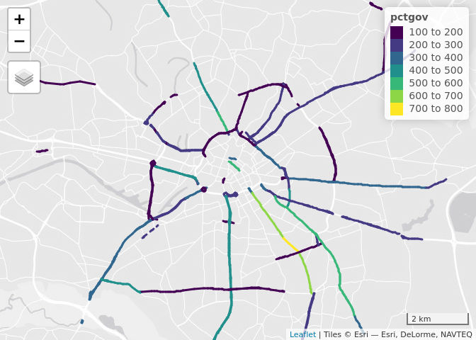

<!-- README.md is generated from README.Rmd. Please edit that file -->

# Data analysis to support temporary cycleways

<!-- badges: start -->

<!-- badges: end -->

The goal of this project is to flag roads on which there is

  - high cycling potential
  - road space that could be re-allocated

in the context of increased for demand for cycling to keyworker
workplaces.

It is based on an analysis of data generated for the Department for
Transport funded projects the Propensity to Cycle Tool (PCT) and the
Cycling Infrastructure Prioritisation Toolkit (CyIPT).

The first stage was to identify cities with high cycling potential. We
did this by analysing data from the PCT project and selecting the top 10
cities, presented in the table below and figure below:

| name       |     all | bicycle | dutch\_slc |
| :--------- | ------: | ------: | ---------: |
| London     | 3634280 |  155694 |     759755 |
| Birmingham |  392517 |    6476 |      76169 |
| Manchester |  199011 |    8447 |      54419 |
| Leeds      |  326680 |    6250 |      51046 |
| Liverpool  |  185117 |    3978 |      48306 |
| Hull       |  105527 |    8974 |      39302 |
| Bristol    |  192881 |   15797 |      37909 |
| Newcastle  |  197070 |    4545 |      37327 |
| Leicester  |  128501 |    4999 |      35253 |
| Portsmouth |   89822 |    7038 |      28036 |

Top 10 cities by cycling potential in England, with ‘all’ representing
all commuters in the 2011 Census, ‘bicycle’ representing the number who
cycled to work and ‘dutch\_slc’ the number who could cycle to work under
a ‘Go Dutch’ scenario of cycling uptake.

<!-- -->

# London

<!-- -->

The top 10 roads:

<!-- -->

| name                 | ref   | highway | region | pctgov | length |
| :------------------- | :---- | :------ | :----- | -----: | -----: |
| Kennington Park Road | A3    | trunk   | London |   3255 |    925 |
| Brixton Road         | A23   | trunk   | London |   2606 |   2849 |
| Stoke Newington Road | A10   | trunk   | London |   2501 |    590 |
| Talgarth Road        | A4    | trunk   | London |   2480 |   1454 |
| Camberwell New Road  | A202  | trunk   | London |   2420 |   1630 |
| Waterloo Bridge      | A301  | primary | London |   2398 |   1166 |
| Theobalds Road       | A401  | primary | London |   2267 |    565 |
| Whitechapel Road     | A11   | trunk   | London |   2111 |   1560 |
| Old Street           | A5201 | primary | London |   2012 |    505 |
| West Cromwell Road   | A4    | trunk   | London |   1971 |   1024 |

# Leeds

<!-- -->

The top 10 roads:

<!-- -->

| name              | ref   | highway   | region | pctgov | length |
| :---------------- | :---- | :-------- | :----- | -----: | -----: |
| Wellington Street |       | secondary | Leeds  |    546 |   1027 |
| Woodhouse Lane    | A660  | trunk     | Leeds  |    368 |   2373 |
| Otley Road        | A660  | trunk     | Leeds  |    325 |   7273 |
| Crown Point Road  | A653  | primary   | Leeds  |    316 |    652 |
| Broadway          | A6120 | trunk     | Leeds  |    267 |   1042 |
| Kirkstall Road    | A65   | primary   | Leeds  |    261 |   3774 |
| Clay Pit Lane     | A58   | trunk     | Leeds  |    257 |   2163 |
| Dewsbury Road     | A6110 | trunk     | Leeds  |    231 |    539 |
| Hunslet Road      | A639  | primary   | Leeds  |    221 |   1860 |
| The Headrow       |       | service   | Leeds  |    216 |    547 |

# Birmingham

<!-- -->

The top 10 roads:

<!-- -->

| name                     | ref   | highway | region     | pctgov | length |
| :----------------------- | :---- | :------ | :--------- | -----: | -----: |
| Pershore Road            | A441  | primary | Birmingham |    618 |   3672 |
| Hagley Road              | A456  | trunk   | Birmingham |    504 |   4229 |
| Bristol Street           | A38   | trunk   | Birmingham |    474 |   1185 |
| Suffolk Street Queensway | A38   | trunk   | Birmingham |    410 |   1595 |
| Queensway                | A38   | trunk   | Birmingham |    332 |   2138 |
| Belgrave Middleway       | A4540 | trunk   | Birmingham |    306 |   2225 |
| High Street              | A34   | trunk   | Birmingham |    301 |   1068 |
| Gravelly Hill North      | A5127 | primary | Birmingham |    261 |    592 |
| Aldridge Road            | A453  | primary | Birmingham |    260 |   2674 |
| New Town Row             | A34   | trunk   | Birmingham |    244 |    870 |
