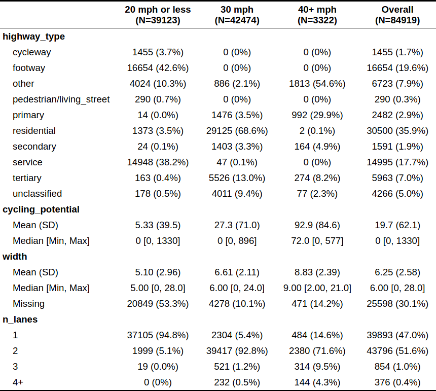
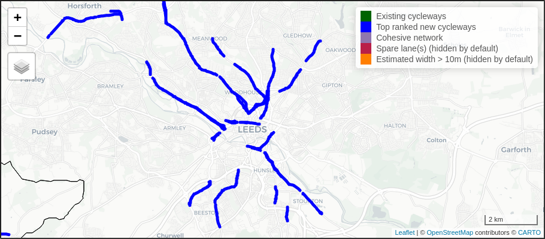

```{r setup, include=FALSE}
knitr::opts_chunk$set(echo = FALSE, message = FALSE, warning = FALSE, cache = FALSE, out.width = "100%")
```

```{r, echo=FALSE, eval=FALSE}
citr::tidy_bib_file("article.Rmd", "~/uaf/allrefs.bib", file = "refs.bib")
wordcountaddin::word_count("article.Rmd")
knitr::purl("article.Rmd")
file.copy("article.R", "code/article-methods-1.R")
pagedown::chrome_print("article.html")
browseURL("article.pdf")
zf = list.files(pattern = "tex|png", full.names = TRUE)
zfl = list.files("article_files/figure-latex/", full.names = TRUE)
fz = c(zf, zfl)
msgf = paste(fz, collapse = " ")
msgf = gsub(pattern = "\\./", replacement = "", msgf)
msg = paste("tar -cvf article.tar ", msgf)
system(msg)
```

# Abstract

<!-- This paper reports on methods developed to support the identification of pop-up active transport infrastructure. -->
In the context of reduced public transport capacity in the wake of the COVID-19 pandemic, governments are scrambling to enable walking and cycling.
A range of pop-up options exist.
The focus of this article is road space reallocation, which represents a 'quick win' for cities with 'spare space' along continuous road sections that have high latent cycling potential.
We developed methods to condense the complexity of city networks down to the most promising roads, producing recommendations that match intuition.
The resulting Rapid Cycleway Prioritisation Tool, deployed for all 78 transport authorities in England at the time of writing, supports evidence-based investment in pop-up and permanent schemes.

# RESEARCH QUESTIONS AND HYPOTHESIS

<!-- The COVID-19 pandemic has transformed all sectors of the economy, not least transport. -->
<!-- [Demand for long distance trips has plummetted](https://osf.io/preprints/socarxiv/v3g5d/) and [airline companies have gone bust](https://arxiv.org/abs/2004.08460) [@iacus_estimating_2020; @jittrapirom_exploratory_2020]. -->
Much attention has focused on the impacts of COVID-19 on long-distance travel patterns [e.g. @iacus_estimating_2020; @jittrapirom_exploratory_2020] but short distance travel patterns have also changed.
There has been a notable increase in cycling in some areas [@harrabin_boom_2020] due to the need increased need for exercise close to home for mental and physical health [@jimenez-pavon_physical_2020] and a reduction in public transport options [e.g. @tian_investigation_2020].
The second reason is particularly important given that many 'key workers' are low paid, with limited access to private automobiles.

<!-- due to cuts in services and fear of being infected while in enclosed spaces, meaning that walking and particularly cycling may be the only way that workers can reach key destinations such as hospitals. -->
<!-- From a physical activity perspective this change is welcome: obesity is a powerful predictor of all-cause mortality, including from COVID-19 [@docherty_features_2020]. -->
<!-- From a physical distancing perspective, increased levels of walking and cycling, -->
<!-- the shift creates pressure on governments to ensure sufficient 'space for social distancing', while enabling increased active mobility for health and travel to key workplaces. -->
<!-- particularly in densly populated urban areas where pavements and cycleways may be narrow,  -->

Local and national governments are working out how best to respond.
Many options are available to ensure that citizens can benefit from outdoor activity while minimising health risks, ranging from the hand sanitiser provision to the creation of extra active transport space [@freeman_covid19_2020].
Installation of 'pop-up' active transport infrastructure has been endorsed and implemented in many places [@laker_world_2020].
The Scottish government, for example, has provided £10 million "to keep key workers moving" by "reallocating road space to better enable this shift and make it safer for people who choose to walk, cycle or wheel for essential trips or for exercise" [@transportscotland_10_2020].
On 9^th^ May 2020, the UK government announced a £250 million package for pop-up active transport infrastructure [@reid_government_2020].
Significantly, alongside this funding comes updated [statutory guidance](https://www.gov.uk/government/publications/reallocating-road-space-in-response-to-covid-19-statutory-guidance-for-local-authorities/traffic-management-act-2004-network-management-in-response-to-covid-19) on pop-up infrastructure and safety.
Evidence is needed to ensure that such investment is spent effectively and where it is most needed.

Most pop-up active transport infrastructure can be classified into three broad categories:


1. 'filtered permeability', where measures such as point closures or contraflow cycle lanes are used to design street networks in which routes for cyclists are faster and more direct than routes for drivers, e.g. as [shown](https://twitter.com/TowerHamletsNow/status/1257564043856019458) in [Tower Hamlets]
2. banning cars and to pedestrianise streets, as in New York's 'Open Streets' scheme [@litman_pandemicresilient_2020]
3. the reallocation of one or more lanes on wide roads to create pop-up cycleways and pavements [@orsman_covid_2020].
<!-- interventions to prevent through traffic, with interventions as part of Salford's ['Liveable Streets' project](https://salfordliveablestreets.commonplace.is/) being a prominent example  -->
<!-- (see [here](https://twitter.com/CatrionaSwanson/status/1258322956595453952) for a photo illustrating this type of intervention) -->

The focus of this article is on the third category.
The research question is:

> How can automated data analysis and interactive visualisation methods help prioritise the reallocation of road space for pop-up active transport infrastructure?

Because of the recent, localised and often ad-hoc nature of pop-up infrastructure, it is difficult to make, let alone test, hypotheses related to the research question.
Our broad hypothesis is that digital tools based on open data, and crowdsourcing such as the interactive map used to support community-level responses to COVID-19 in Salford [@salfordcitycouncil_salford_2020], illustrated in Figure 1, can lead to more effective use of resources allocated to pop-up interventions.

```{r commonplace, fig.cap="Screenshot from the website salfordliveablestreets.commonplace.is to support local responses to the COVID-19 pandemic, including the prioritisation of pop-up active transport infrastructure."}
# knitr::include_graphics("https://user-images.githubusercontent.com/1825120/81451234-ed82d200-917b-11ea-977d-fff1665378c5.png")
# download.file("https://user-images.githubusercontent.com/1825120/81451234-ed82d200-917b-11ea-977d-fff1665378c5.png", "saferstreets.png")
knitr::include_graphics(c(
  "figures/saferstreets.png",
  "figures/widenmypath-bristol.png"
  ))
```

 <!-- With the rush to act, there is a great need for evidence of *where* new interventions should be prioritised. As with the medical science, research is needed now. Methods developed to identify locations of high walking and cycling potential can help ensure that the 'pop-up' infrastructure that goes in now is effective, safe, and placed where it is most needed. -->

# METHODS AND DATA

```{r load}
library(sf)
library(tidyverse)
library(tmap)
region_name = "West Yorkshire"
# source("code/build.R")
# saveRDS(r_main_region, "r_main_region.Rds")
# r_main_leeds = r_main_region[region, ]
# saveRDS(r_main_leeds, "r_main_leeds.Rds")
# piggyback::pb_upload("r_main_leeds.Rds")
if(!file.exists("r_main_leeds.Rds")) {
  u = "https://github.com/cyipt/popupCycleways/releases/download/v1/r_main_leeds.Rds"
  download.file(u, "r_main_leeds.Rds")
}
if(file.exists("r_main_region.Rds")) {
  rj = readRDS("r_main_region.Rds")
} else {
  rj = readRDS("r_main_leeds.Rds")
}
# r_lanes_joined = r_lanes_joined[region, ]
# saveRDS(r_lanes_joined, "r_lanes_joined.Rds")
# piggyback::pb_upload("r_lanes_joined.Rds")
if(!file.exists("r_lanes_joined.Rds")) {
  u = "https://github.com/cyipt/popupCycleways/releases/download/v1/r_lanes_joined.Rds"
  download.file(u, "r_lanes_joined.Rds")
}
r_lanes_joined = readRDS("r_lanes_joined.Rds")
region = ukboundaries::leeds
tmap_mode("plot")
```

```{r parameters}
regexclude = "welling"
min_cycling_potential = 0
min_grouped_cycling_potential = 50
min_grouped_length = 500
city_centre_buffer_radius_small = 5000
city_centre_buffer_radius = 8000
city_centre_buffer_radius_large = 10000
key_destination_buffer_radius = 5000
city_centre = tmaptools::geocode_OSM("leeds", as.sf = TRUE)
city_centre_buffer_small = stplanr::geo_buffer(city_centre, dist = city_centre_buffer_radius_small)
city_centre_buffer = stplanr::geo_buffer(city_centre, dist = city_centre_buffer_radius)
city_centre_buffer_large = stplanr::geo_buffer(city_centre, dist = city_centre_buffer_radius_large)
hsf = readRDS(url("https://github.com/cyipt/popupCycleways/releases/download/0.1/acute_hospitals.Rds"))
h_leeds = hsf[city_centre_buffer, ]
h_leeds_buffer = stplanr::geo_buffer(h_leeds, dist = key_destination_buffer_radius)
city_key_buffer = st_union(city_centre_buffer, st_union(h_leeds_buffer))
```

```{r preprocess}
cy = sf::read_sf("https://www.cyipt.bike/rapid/west-yorkshire/cycleways.geojson")
cy = sf::read_sf("https://www.cyipt.bike/rapid/west-yorkshire/cycleways.geojson")
r_central = rj[city_centre_buffer, ]
r_central_key = rj[city_key_buffer, ]
r_main = r_central %>% 
  filter(grepl(pattern = "cycleway|primary|second|tert", highway_type))
r_main_region = rj %>% 
  filter(grepl(pattern = "cycleway|primary|second|tert", highway_type))
```

Two key datasets were used for the project:

- Estimates of cycling potential at the street segment level from the UK Department for Transport funded Propensity to Cycle Tool (PCT) project [@goodman_scenarios_2019; @lovelace_propensity_2017]
- Data derived from OpenStreetMap, with several new variables added to support cycling infrastructure planning (see www.cyipt.bike for an overview)
<!-- - Data on the location of road traffic casualties from -->

Datasets from the PCT and CyIPT project were merged, resulting in crucial variables summarised in Table 1.
Cycling potential is defined as the number of one-way journeys to work and to school, under a scenario in which the government aim of doubling cycling levels is met.
This does not include other types of journey such as leisure and shopping.

Roads are classified by speed limit because this has been shown to be a key factor associated with the incidence of severe injuries and fatalities of cyclists [@chen_built_2016], with odds of cyclist injury on 20 mph roads in London found to be 21% lower than on 30 mph roads [@aldred_cycling_2018]. 
Therefore the suitability of roads for cycle infrastructure, the preferred degree of physical segregation, or the necessity to reduce traffic speeds could all be influenced by current speed limits.

Table 1: Summary of the road segment dataset for Leeds

```{r t1, results='asis'}
# rj %>%
#   st_drop_geometry() %>%
#   # select(name, highway_type, maxspeed, cycling_potential, width) %>%
#   table1::table1(~ highway_type + cycling_potential + width + n_lanes | maxspeed, data = ., )
# ut = "https://user-images.githubusercontent.com/1825120/81476961-c32d2500-920c-11ea-8430-94c3afc2e27d.png"
# knitr::include_graphics(ut)
# system(paste("wget ", ut))

```

<!-- Could say more about the case study city here if there is space -->

## Geographic subsetting

The region of analysis may seem like a basic consideration: most cities have well-defined administrative zones.
In Leeds and many other cities, it makes sense to focus on the region directly surrounding the city centre, in a kind of 'geographical triage' to omit from the analysis pop-up options in the outskirts, focus valuable attention on the routes that are most likely to serve the highest number of people, and ensure that road sections outside administrative areas but close to key destinations are included.

<!-- The parameter `city_centre_buffer_radius` with an initial value of 8 km (5 miles) to geographically subset potential routes. -->
<!-- This represents a distance that most people have the physical ability to cycle. -->
Figure \@ref(fig:gsub) shows three broad strategies for geographic subsetting: based on administrative boundaries, distance from the centre, and distance from the centre and key destinations.
The latter case (Figure \@ref(fig:gsub), right) shows that administrative boundaries can exclude important roads.
The definition of 'city centres' and 'key destinations' is straightforward in clearly defined and well-understood city planning contexts.
In contexts where the method must be deployed nationwide, however the use of such subsetting approaches was found to be problematic, so the Rapid Cycleway Prioritisation Tool for England (v1) uses the first subsetting option, but subsets by larger regional boundaries to encourage regional collaboration on cycleway network design.
<!-- could say more... -->

```{r gsub, fig.height=3, fig.cap="Illustration of geographic subsetting based on administrative boundaries (left), distance to a central point (middle) and distance to city centre or key destinations (right). Radii of 5 km, 8 km and 10 km are shown for reference (note that some roads within 10 km of the center are outside the regional boundary)."}
# nrow(r_central)
# nrow(rj)
square = stplanr::geo_bb(shp = city_centre_buffer)
r_main_region_key = r_main_region[city_key_buffer, ]
r_main_city = r_main_region[region, ]
m1 = tm_shape(r_main_city) +
  tm_lines("maxspeed", palette = "-Set1", lwd = "n_lanes_numeric", scale = 5,
           lwd.legend = c(1, 2, 3, 4, 5, 6), title.lwd = "Number of lanes") +
  tm_shape(region) + tm_borders(col = "black", lwd = 2) +
  tm_shape(square) + tm_borders(lty = 3) +
  tm_scale_bar() 
# m1
m2 = tm_shape(r_main) +
  tm_lines("maxspeed", palette = "-Set1", lwd = "n_lanes_numeric", scale = 5,
           lwd.legend = c(1, 2, 3, 4, 5, 6), title.lwd = "Number of lanes") +
  tm_shape(city_centre_buffer_small) + tm_borders(lty = 2) +
  tm_shape(city_centre_buffer_large) + tm_borders(lty = 2) +
  tm_shape(region) + tm_borders(col = "black", lwd = 2) +
  tm_shape(city_centre_buffer) + tm_borders() +
  tm_scale_bar() +
  tm_layout(legend.show = FALSE)
m3 = tm_shape(r_main_region_key) +
  tm_lines("maxspeed", palette = "-Set1", lwd = "n_lanes_numeric", scale = 5,
           lwd.legend = c(1, 2, 3, 4, 5, 6), title.lwd = "Number of lanes") +
  tm_shape(city_centre_buffer) + tm_borders(lty = 2) +
  tm_shape(city_centre_buffer_small) + tm_borders(lty = 2) +
  tm_shape(city_centre_buffer_large) + tm_borders(lty = 2) +
  tm_shape(city_key_buffer) + tm_borders() +
  tm_shape(region) + tm_borders(col = "black", lwd = 2) +
  tm_shape(h_leeds) + tm_dots(size = 0.5) +
  tm_scale_bar() +
  tm_layout(legend.show = FALSE)
# this take aaaages to render...
tmap_arrange(m1, m2, m3, nrow = 1)
```

## Road attributes

Pop-up cycleways can be placed either on the side of wide roads (as is the case on [South Road, Lancaster](https://www.lancasterguardian.co.uk/news/uk-news/mixed-reactions-new-lancaster-pop-cycle-lanes-busy-city-centre-road-2875909)) or in an entire lane that has been closed to motor traffic (as is the case on [Park Lane](https://metro.co.uk/2020/05/14/road-turns-giant-cycle-lane-make-social-distancing-easier-12703847/), London).
Accordingly, we defined 'spare space' as either roads on which there is more than one lane in either direction or lane width above a threshold (set at 10 m based on feedback from engineers and the observation that South Road has a width of ~9 m yet can just fit cycleways protected by plastic 'wands').
This definition assumes no alteration of the navigable network for motor vehicles.

To identify road sections with a spare lane we developed a simple algorithm that takes the OSM variable [`lanes`](https://wiki.openstreetmap.org/wiki/Key:lanes) if it is present and, if not, derives the number from the highway type and presence/absence of bus lanes.
Width estimates were taken from the CyIPT tool (see [www.cyipt.bike](https://www.cyipt.bike/) for details).
All segments defined as having a spare space using this method are shown in Figure \@ref(fig:levels) (left).

## Attribute filtering and grouping

To ensure our route recommendations could achieve sufficient coherency, we undertook several stages of road segment filtering and grouping. 
Segments were grouped by road reference number (i.e. 'A' or 'B' road number) and by proximing, within a 100 m buffer.
Filtering then removed groups without distance weighted mean width >= 10 m or spare lanes along the majority of their length, and groups with distance-weighted mean cycling potential below a minimum threshold.
<!-- defined as one twenty-fifth of the 99th percentile segment level cycling potential within the city.  -->

Segments without a reference number were subjected to stricter filtering criteria, to prevent the inclusion of unwanted short segments on side streets. 
<!-- Any of these segments that had cycling potential below 30 were excluded from the analysis.  -->
<!-- The segments were then grouped using a 20m buffer.  -->
<!-- Filtering followed the same criteria as for other roads, plus an additional filter to remove groups with length below 300 m. -->
For all segments, a final round of grouping (ignoring previous groups) with a 100 m buffer was then used to remove groups with length below 500 m. 
This step removed short sections distant from any others, thus improving the coherency of the results.
Finally, road names were used to identify continuous road sections with the same name of length >= 500m.
Groups containing five or more different named roads were labeled "Unnamed road."
An example of the impact of grouping strategy is shown in Figure \@ref(fig:levels). 
<!-- Segments are grouped with a 100 m buffer, using the `igraph` R package; they are also filtered to exclude sections below a minimum length and cycling potential.  -->
<!-- The threshold length and cycling potential are adaptable depending on the nature of the region being studied and local cycling levels. -->
The resulting network shows that grouping the segments first then filtering based on mean group-level attributes results in a more cohesive network than filtering individual segments then grouping the results. 


<!-- Note this could be a function in an R package.. -->
<!-- see https://github.com/cyipt/cyipt/blob/82248b2f99e388fac314d34ec5aa49bb90a737a3/scripts/prep_data/clean_osm.R#L349 -->

<!-- reallocated road space in particular -->
<!-- An important distinction when developing methods for automated analysis of transport networks is the level of analysis. -->


```{r levels, fig.height=3, fig.cap="Illustration of the 'group then filter' method to identify roads with spare space that meet threshold values for length and cycling potential. The right hand panel contains roads on which the majority of segments have spare space (including segments that may not on their own be estimated to have spare space), coloured by group membership."}
r_pct_lanes_all = r_central %>% 
  filter(cycling_potential > min_cycling_potential) %>% 
  mutate(spare_lane = lanes_f > 1 | lanes_b > 1) %>%
  filter(spare_lane | width >= 10) # need to add in roads >10m width
# mapview::mapview(r_pct_lanes)
r_lanes_central = r_lanes_joined %>% sf::st_intersection(city_centre_buffer)

touching_list = st_touches(r_pct_lanes_all)
g = igraph::graph.adjlist(touching_list)
components = igraph::components(g)
r_pct_lanes_all$group = components$membership
r_pct_lanes = r_pct_lanes_all %>% 
  group_by(group) %>% 
  mutate(group_length = sum(length)) %>% 
  mutate(cycling_potential_mean = weighted.mean(cycling_potential, w = length, na.rm = TRUE)) %>% 
  filter(cycling_potential_mean > min_grouped_cycling_potential)
r_pct_lanes = r_pct_lanes %>% filter(group_length > min_grouped_length) %>% 
  ungroup()

r_pct_lanes$graph_group = r_pct_lanes$group
group_table = table(r_pct_lanes$group)
top_groups = tail(sort(group_table), 5)
r_pct_lanes$graph_group[!r_pct_lanes$graph_group %in% names(top_groups)] = "other"

r_filter_before_grouping = r_central %>% 
  filter(cycling_potential > min_cycling_potential) %>% 
  filter(lanes_f > 1 | lanes_b > 1) %>% 
  filter(cycling_potential > min_grouped_cycling_potential) %>% 
  filter(length > 100)
tmap_mode("plot")
m0 = tm_shape(city_centre_buffer) + tm_borders(col = "grey") +
  tm_shape(r_pct_lanes_all) + tm_lines() +
  tm_layout(title = "Roads on which there is 'spare space'.")
m1 = tm_shape(city_centre_buffer) + tm_borders(col = "grey") +
  tm_shape(r_filter_before_grouping) + tm_lines() +
  tm_layout(title = "Filter then group:\n(length > 100, cycling_potential > 50)")
m2 = tm_shape(city_centre_buffer) + tm_borders(col = "grey") +
  tm_shape(r_lanes_central) + tm_lines("group_id", palette = "Dark2", legend.col.show = FALSE) +
  tm_layout(title = "Group then filter:\n(length > 500, cycling_potential > 50)")
# todo show group membership with colours
ma = tmap_arrange(m0, m1, m2, nrow = 1)
ma
```

```{r joining}
top_routes = sf::read_sf("https://www.cyipt.bike/rapid/west-yorkshire/top_routes.geojson")
top_routes_leeds = top_routes[region, ]

r_pct_top_n = top_routes_leeds %>% 
  top_n(10, wt = mean_cycling_potential) 
# aim: make the labels go on the longest sections
# %>% 
#   st_cast("LINESTRING") %>% 
#   mutate(length_section = as.numeric(st_length(.))) %>% 
#   group_by(name) %>% 
#   slice(which.max(length_section))
# r_pct_top_n$name
# summary(r_pct_grouped$group_length)
```

## Selection of top routes

Top routes were selected from the results of the previous steps. 
These must not be labeled "Unnamed road" or have existing cycleways along more than 80% of their length. 
A high threshold was chosen here because the presence of an existing cycleway on OSM does not mean that this is necessarily a high quality cycleway. 
Continuity of cycle provision is important for creating high quality networks [@parkin_designing_2018].

<!-- ## Scenarios and visualisation -->

<!-- To make the results more accessible and actionable we have made the results, discussed in the next section, publicly available at  -->


# FINDINGS

The results of the method applied to the city of Leeds are shown in Figure \@ref(fig:res) (see [cyipt.bike/rapid](https://www.cyipt.bike/rapid/west-yorkshire/) for interactive version) and Table 2.
We found that analysis of open transport network data, alongside careful selection of parameters, can generate plausible results for the prioritisation of pop-up cycle infrastructure.
Reducing the 85,000 road segments for Leeds down to a handful of candidate segments with more than 1 lane near key destinations has great potential to support policy-makers, especially when decisions need to be made fast.

```{r res, fig.cap="Results, showing road segments with a spare lane (light blue) and road groups with a minium threshold length, 1km in this case (dark blue). The top 10 road groups are labelled."}
tmap_mode("view")
# tm_shape(r_pct_no_overlap) + tm_lines(col = "lightblue", lwd = 4, alpha = 0.6) +
#   tm_shape(r_pct_top) + tm_lines(col = "blue", lwd = 4, alpha = 0.6) +
#   tm_shape(r_pct_top_n) + tm_text("name") +
#   tm_shape(h_leeds) + tm_dots(size = 0.1)
 # this needs changing
```

```{r}
res_table = r_pct_top_n %>% 
  sf::st_drop_geometry() %>% 
  arrange(desc(mean_cycling_potential)) %>% 
  select(Name = name, `Length (m)` = length..m., `Potential (Government Target)` = mean_cycling_potential) %>% 
  mutate(`Km/day (length * potential)` = `Potential (Government Target)` * `Length (m)`)
knitr::kable(res_table, caption = "The top 10 candidate roads for space reallocation for pop-up lane reallocation interventions. Roads with 'spare lanes' identified using methods presented in the paper are ranked by cycling potential under the Government Target scenario, representing a doubling in commuter and school cycling levels compared with 2011 levels.", digits = 0)
```

An illustration of the scale of the results is shown in Figure \@ref(fig:facets), which shows the results for six major cities in England.
Local authorities are planning new pop-up cycleways informed by a range of sources of evidence, including the Rapid Cycleway Prioritisation Tool, and in many cases the plans match the routes highlighted by our tool.^[
[Kirkstall Road](https://www.bbc.co.uk/news/uk-england-leeds-52577554) in Leeds and [Jamaica Road](https://www.se16.com/6208-work-starts-on-54m-cycleway-along-jamaica-road) in London are a couple of examples.
Many more examples can be found on posts mentioning the tool on [social media](https://twitter.com/search?q=cyipt.bike%2Frapid).
]

The approach is not without limitations.
Its reliance on data rather than community engagement represents a rather top-down approach to transport planning.
To overcome this issue, future work could seek to incorporate the results such as those presented above into a participatory map of the type shown in Figure 1.
Further work could also extend the method in various ways, for example by refining estimates of cycling potential based on new parameters such as proximity to key destinations and estimates of road width.
We welcome feedback on the results and methods [link to code].

A major advantage of the approach is that it is scalable.
It would be feasible to run the method for every city in the UK (and indeed beyond) for which there is data, given sufficient computer and developer resource.
Given the recent interest in and funding for pop-up cycleways, rolling-out the method quickly, while being agile to adapt the method and parameters for different cities, could help ensure that funding for pop-up infrastructure is spent in an evidence-based way.

<!-- Guidance from https://transportfindings.org/for-authors -->

<!-- Transport Findings welcomes research findings in the broad field of transport. Articles must either pose a New Question,  present a New Method, employ New Data (including New Contexts or Locations),  discover a New Finding (i.e. it can almost exactly replicate a previous study and find something different), or some combination of the above. -->
<!-- Scope -->

<!-- You may find yourself asking if your paper is within the scope of Transport Findings. -->

<!--     Is there a hypothesis somehow related to transport? -->
<!--     Is there a (scientifically valid, replicable) methodology? -->
<!--     Is there a finding? -->

<!-- If you can answer yes to these questions, it is within scope. -->
<!-- Article Types -->

<!--     Findings - where the object of study is nature -->
<!--     Syntheses - where the object of study is the literature -->
<!--     Cases - where the objects of study are particular sites or projects, and methods may be more qualitative -->

<!-- Sections -->

<!-- All articles shall have 3 sections, and only 3 sections, titled as follows: -->

<!--     RESEARCH QUESTION[S] AND HYPOTHESIS[ES] -->
<!--     METHODS AND DATA -->
<!--     FINDINGS -->

<!-- There shall be no introduction, "road-map paragraph," literature review, conclusions, speculations, or  policy implications beyond what is included above. Focus on what you found, not why you found it. -->
<!-- Submissions -->

<!-- The manuscript submission must include the following: -->
<!-- TITLE -->
<!-- AUTHORS (NAME, AFFILIATION, CONTACT) -->
<!-- ABSTRACT -->
<!-- KEYWORDS -->
<!-- ARTICLE (Sections 1, 2, 3) -->
<!-- ACKNOWLEDGMENTS -->
<!-- REFERENCES -->

<!-- Manuscript submissions may include SUPPLEMENTAL INFORMATION in separate files that do not count against article length. This information should not be essential for the general understanding of the manuscript. -->
<!-- Style -->
<!-- Focus and Parsimony -->

<!-- Papers should be focused and to the point, and not begin with trite observations like "Congestion is a problem the world over." Usually you can delete your opening paragraph if it begins like that, and the reader is no worse off. As Strunk and White say: "Omit Needless Words". The Abstract should not say the same thing as the Introduction. -->
<!-- Transparency and Replicability -->

<!-- A minimum standard for a good paper is transparency and replicability: Can the reader understand what you did, and repeat it, and get the same answer? -->
<!-- Mathematical Conventions -->

<!-- Each variable shall have one, and only one, definition per document. -->

<!-- Each defined term in the document shall be represented by one and only one variable. -->

<!-- Lowercase and uppercase versions of the same letter should be logically related. For instance, use lowercase letters to define the PDF (probability distribution function) or individual instance, and uppercase letters the CDF (cumulative distribution function) or population, so when you sum:  i=1 to I, k=1 to K, etc. -->

<!-- All variables shall be a single letter or symbol. Double or triple letter variables can be confused with multiplication. If you have more than 52 symbols in your paper (26 letters for both lower and upper case), consider (a) there are too many, and (b) using Greek or Hebrew characters. -->

<!-- Use subscripts liberally to differentiate things that, for instance, are of a class but measured differently, or computed with different assumptions. -->

<!-- All equations shall have all of their variables defined. -->

```{r, eval=FALSE}
# system("")
# # system("iconv -c -f utf-8 -t ascii uh.csv")
# system("iconv -f Latin-1 -t ascii uh.csv -o uh_new.csv")
# system("sd � , uh.csv")
# system("head uh.csv")
# h = readr::read_csv("http://media.nhschoices.nhs.uk/data/foi/Hospital.csv")
# h = read.csv("http://media.nhschoices.nhs.uk/data/foi/Hospital.csv", , fileEncoding="latin1", sep = "¬", colClasses = c(NA, "NULL"))
# h = data.table::fread("http://media.nhschoices.nhs.uk/data/foi/Hospital.csv", encoding = "Latin-1")
# h = data.table::fread("http://media.nhschoices.nhs.uk/data/foi/Hospital.csv", encoding = "UTF-8")
# h$V1 = gsub(pattern = "")
```

<!-- Todo final bit -->

<!-- - check over the responses to reviewers -->
<!-- - double check and update the paper with new images from the tool  -->

# References

