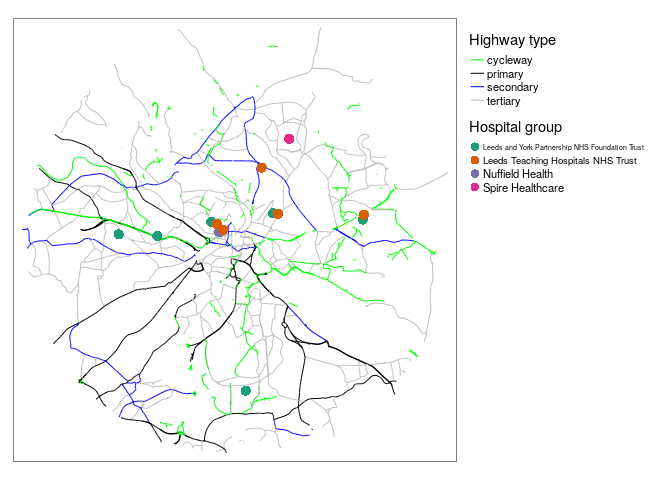
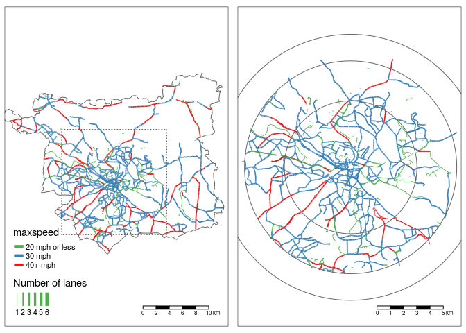
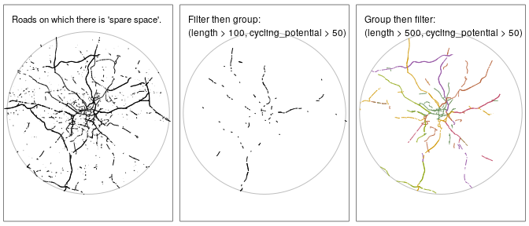
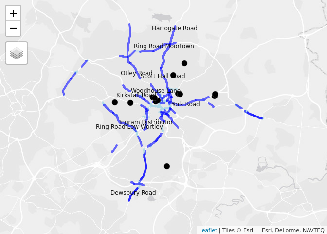

Methods to prioritise pop-up active transport infrastructure
================
Robin Lovelace

# RESEARCH QUESTIONS AND HYPOTHESIS

<!-- Currently the intro is 350 words, just about OK! -->

<!-- The Covid-19 pandemic has transformed all sectors of the economy, not least transport. -->

<!-- [Demand for long distance trips has plummetted](https://osf.io/preprints/socarxiv/v3g5d/) and [airline companies have gone bust](https://arxiv.org/abs/2004.08460) [@iacus_estimating_2020; @jittrapirom_exploratory_2020]. -->

Much attention has focused on the impacts of Covid-19 on long distance
travel patterns (e.g. Iacus et al. 2020; Jittrapirom and Tanaksaranond
2020). Yet short distance travel patterns have also changed, with a
notable uptick in active travel, particularly cycling, in some areas
(Harrabin 2020). The two main explanations for this are 1) the need
increased need for exercise close to home during lockdowns for mental
and physical health (Jim’enez-Pav’on, Carbonell-Baeza, and Lavie 2020);
and 2) reduced public transport options and use (e.g. Tian et al. 2020).
The second reason is particularly important given that many ‘key
workers’ are low paid, with limited access to private automobiles.

<!-- due to cuts in services and fear of being infected while in enclosed spaces, meaning that walking and particularly cycling may be the only way that workers can reach key destinations such as hospitals. -->

<!-- From a physical activity perspective this change is welcome: obesity is a powerful predictor of all-cause mortality, including from Covid-19 [@docherty_features_2020]. -->

<!-- From a physical distancing perspective, increased levels of walking and cycling, -->

<!-- the shift creates pressure on governments to ensure sufficient 'space for social distancing', while enabling increased active mobility for health and travel to key workplaces. -->

<!-- particularly in densly populated urban areas where pavements and cycleways may be narrow,  -->

Local and national governments are working out how best to respond. Many
options are available to ensure that citizens can benefit from outdoor
activity while minimizing health risks, ranging from the hand sanitiser
provision to the creation of extra active transport space (Freeman and
Eykelbosh 2020). Installation of ‘pop-up’ active transport
infrastructure has been endorsed and implemented in many places (Laker
2020). The Scottish government, for example, has provided £10 million
“to keep key workers moving” by “reallocating road space to better
enable this shift and make it safer for people who choose to walk, cycle
or wheel for essential trips or for exercise” (Transport Scotland 2020).
On 9th May 2020, the UK government announced a £250 million
package for pop-up active transport infrastructure (Reid 2020). Evidence
is needed to ensure that such investment is spent effectively and were
it is most needed.

Most pop-up active transport infrastructure can be classified into three
broad categories:

1.  ‘filtered permeability’, e.g. as
    [shown](https://twitter.com/CatrionaSwanson/status/1258322956595453952)
    in (Salford City Council 2020)

2.  banning cars and to pedestrianise streets, as in New York’s ‘Open
    Streets’ scheme (Litman 2020)

3.  the reallocation of one or more lanes on wide roads to create pop-up
    cycleways (Orsman 2020).
    <!-- interventions to prevent through traffic, with interventions as part of Salford's ['Liveable Streets' project](https://salfordliveablestreets.commonplace.is/) being a prominent example  -->
    <!-- (see [here](https://twitter.com/CatrionaSwanson/status/1258322956595453952) for a photo illustrating this type of intervention) -->

The focus of this article is on the third category. The research
question is:

> How can automated data analysis and interactive visualisation methods
> help prioritise the reallocation of road space for pop-up active
> transport infrastructure?

Because of the recent, localised and often ad-hoc nature of pop-up
infrastructure, it is difficult to make, let alone test, hypotheses
related to the research question. Our broad hypothesis is that digital
tools based on open data, such as the interactive map used to support
community-level responses to Covid-19 in Salford (Salford City Council
2020), illustrated in Figure 1, can lead to more effective use of
resources allocated to pop-up interventions.

Figure 1: Screenshot from the website
salfordliveablestreets.commonplace.is to support local responses to the
Covid-19 pandemic, including the prioritisation of pop-up active
transport infrastructure.

<!-- With the rush to act, there is a great need for evidence of *where* new interventions should be prioritised. As with the medical science, research is needed now. Methods developed to identify locations of high walking and cycling potential can help ensure that the ‘pop-up’ infrastructure that goes in now is effective, safe, and placed where it is most needed. -->

# METHODS AND DATA

Three main datasets were used for the project:

  - Estimates of cycling potential to work at the street segment level
    from the UK Department for Transport funded Propensity to Cycle Tool
    (PCT) project (Goodman et al. 2019; Lovelace et al. 2017; Lovelace
    and Hama 2019)
  - Data derived from OpenStreetMap, with a number of new variables
    added to support cycling infrastructure planning (see www.cyipt.bike
    for an overivew)
  - A list hospital locations from the UK’s National Health Service
    website
    [www.nhs.uk](https://www.nhs.uk/about-us/nhs-website-datasets/)
    <!-- - Data on the location of road traffic casualties from -->

Datasets from the PCT and CyIPT project were merged, resulting in key
variables summarised in Table 1. A map showing the spatial distribution
of hospitals in the case study city of Leeds is shown in Figure
<a href="#fig:hospitals">2</a>.

Table 1: Summary of the main road segment dataset for Leeds

<!-- -->

Figure 2: Overview map of input data, showing the main highway types and
location of hospitals in Leeds

<!-- Could say more about the case study city here if there is space -->

## Geographic subsetting

<!-- The region of analysis may seem like a basic consideration: most cities have well-defined administrative zones. -->

<!-- In Leeds and many other cities, it makes sense to focus on the region directly surrounding the city centre, in a kind of 'geographical triage' to omit from the analysis pop-up options in the outskirts and focus valuable attention on the routes that are most likely to serve the highest number of people. -->

We set a modifiable parameter `city_centre_buffer_radius` with an
initial value of 8 km (5 miles) to geographically subset potential
routes. Figure <a href="#fig:gsub">3</a> shows the result of subsetting
based on physical distance from the center vs plotting all possible
transport network segments within the city boundaries. To ensure roads
that could serve key destinations were included, the parameter
`key_destination_buffer_radius` (initially set to 5 km) was used.
<!-- could say more... -->

Figure 3: Illustration of geographic subsetting based on distance to a
central point (Leeds city city centre in this case) rather than based on
location within somewhat arbitrarily shaped city boundaries. Radii of 5
km, 8 km and 10 km are shown for reference (note that some roads within
10 km of the center are outside the regional boundary).

## Attribute filtering and grouping

At a time of reduced travel, fewer lanes dedicated for motor traffic are
needed. Based on this observation, we defined roads with a ‘spare lane’
as those on which there is more than one lane in either direction. This
definition assumes no reduction in mobility for motor vehicles (making
twoway lanes oneway is another option not explored in this analysis).

To identify road sections on which there is a spare lane we developed a
simple algorithm that takes the OSM variable
[`lanes`](https://wiki.openstreetmap.org/wiki/Key:lanes) if it is
present and, if not, derives the number from the highway type and
presence/absence of bus lanes. All segments defined as having a spare
lane using this method is shown in Figure <a href="#fig:levels">4</a>
(left). The result of filtering by distance and cycling potential before
and after grouping using graph membership of touching roads is shown in
<a href="#fig:levels">4</a> (middle and right, respectively). Grouping
linked roads before filtering results in a more cohesive network.

<!-- Note this could be a function in an R packge.. -->

<!-- see https://github.com/cyipt/cyipt/blob/82248b2f99e388fac314d34ec5aa49bb90a737a3/scripts/prep_data/clean_osm.R#L349 -->

<!-- reallocated road space in particular -->

<!-- An important distinction when developing methods for automated analysis of transport networks is the level of analysis. -->

Figure 4: Illustration of the ‘group then filter’ method to identify
long sections with spare lanes *and* high cycling potential

<!-- ## Scenarios and visualisation -->

<!-- To make the results more accessible and actionable we have made the results, discussed in the next section, publicly available at  -->

# FINDINGS

The results of the method are summarised in Figure
<a href="#fig:res">5</a> and Table 2. We have found that analysis of
open transport network data, alongside careful selection of parameters,
can generate plausible results for the prioritisation of pop-up cycle
infrastructure. Reducing the 85,000 road segments for Leeds down to
candidate segments with more than 1 lane near key destinations that can
be visualised in an interactive map can has great potential to support
policy-makers, especially when decisions need to be made fast.

Figure 5: Results, showing road segments with a spare lane (light blue)
and road groups with a minium threshold length, 1km in this case (dark
blue). The top 10 road groups are labelled.

| name                  | length | cycling\_potential | kkm\_cycled |
| :-------------------- | -----: | -----------------: | ----------: |
| Otley Road            |   1766 |                758 |        1339 |
| Scott Hall Road       |   8723 |                123 |        1073 |
| Ring Road Low Wortley |   5177 |                151 |         782 |
| Dewsbury Road         |   4073 |                175 |         713 |
| Woodhouse Lane        |   2206 |                295 |         651 |
| Kirkstall Road        |   1557 |                341 |         531 |
| Ring Road Moortown    |   4152 |                123 |         511 |
| York Road             |   1883 |                242 |         456 |
| Harrogate Road        |   3254 |                123 |         400 |
| Ingram Distributor    |   2771 |                137 |         380 |

Table 1: The top 10 candidate roads for space reallocation for pop-up
active transport infrastructure according to methods presented in this
paper.

The approach is not without limitations. Its reliance on data rather
than community engagement represents a rather top-down approach to
transport planning. To overcome this issue future work could seek to
incorporate the results such as those presented above into a
participatory map of the type shown in Figure 1. Further work could also
extend the method in various ways, for example by refining estimates of
cycling potential based on new parameters such as proximity to key
destinations.

A major advantage of the approach is that it is scalable. It would be
feasible to run the method for every city in the UK for which there is
data, given sufficient computer and developer resource. Given the recent
interest in and funding for pop-up cycleways, rolling-out the method
quickly, while being agile to adapt the method and parameters for
different cities, could help ensure that funding for pop-up
infrastructure is spent in an evidence-based way.

<!-- Guidance from https://transportfindings.org/for-authors -->

<!-- Transport Findings welcomes research findings in the broad field of transport. Articles must either pose a New Question,  present a New Method, employ New Data (including New Contexts or Locations),  discover a New Finding (i.e. it can almost exactly replicate a previous study and find something different), or some combination of the above. -->

<!-- Scope -->

<!-- You may find yourself asking if your paper is within the scope of Transport Findings. -->

<!--     Is there a hypothesis somehow related to transport? -->

<!--     Is there a (scientifically valid, replicable) methodology? -->

<!--     Is there a finding? -->

<!-- If you can answer yes to these questions, it is within scope. -->

<!-- Article Types -->

<!--     Findings - where the object of study is nature -->

<!--     Syntheses - where the object of study is the literature -->

<!--     Cases - where the objects of study are particular sites or projects, and methods may be more qualitative -->

<!-- Sections -->

<!-- All articles shall have 3 sections, and only 3 sections, titled as follows: -->

<!--     RESEARCH QUESTION[S] AND HYPOTHESIS[ES] -->

<!--     METHODS AND DATA -->

<!--     FINDINGS -->

<!-- There shall be no introduction, “road-map paragraph,” literature review, conclusions, speculations, or  policy implications beyond what is included above. Focus on what you found, not why you found it. -->

<!-- Submissions -->

<!-- The manuscript submission must include the following: -->

<!-- TITLE -->

<!-- AUTHORS (NAME, AFFILIATION, CONTACT) -->

<!-- ABSTRACT -->

<!-- KEYWORDS -->

<!-- ARTICLE (Sections 1, 2, 3) -->

<!-- ACKNOWLEDGMENTS -->

<!-- REFERENCES -->

<!-- Manuscript submissions may include SUPPLEMENTAL INFORMATION in separate files that do not count against article length. This information should not be essential for the general understanding of the manuscript. -->

<!-- Style -->

<!-- Focus and Parsimony -->

<!-- Papers should be focused and to the point, and not begin with trite observations like “Congestion is a problem the world over.” Usually you can delete your opening paragraph if it begins like that, and the reader is no worse off. As Strunk and White say: “Omit Needless Words”. The Abstract should not say the same thing as the Introduction. -->

<!-- Transparency and Replicability -->

<!-- A minimum standard for a good paper is transparency and replicability: Can the reader understand what you did, and repeat it, and get the same answer? -->

<!-- Mathematical Conventions -->

<!-- Each variable shall have one, and only one, definition per document. -->

<!-- Each defined term in the document shall be represented by one and only one variable. -->

<!-- Lowercase and uppercase versions of the same letter should be logically related. For instance, use lowercase letters to define the PDF (probability distribution function) or individual instance, and uppercase letters the CDF (cumulative distribution function) or population, so when you sum:  i=1 to I, k=1 to K, etc. -->

<!-- All variables shall be a single letter or symbol. Double or triple letter variables can be confused with multiplication. If you have more than 52 symbols in your paper (26 letters for both lower and upper case), consider (a) there are too many, and (b) using Greek or Hebrew characters. -->

<!-- Use subscripts liberally to differentiate things that, for instance, are of a class but measured differently, or computed with different assumptions. -->

<!-- All equations shall have all of their variables defined. -->

# References

Freeman, Shirra, and Angela Eykelbosh. 2020. “COVID-19 and Outdoor
Safety: Considerations for Use of Outdoor Recreational Spaces.” BC
Centre for Disease Control.

Goodman, Anna, Ilan Fridman Rojas, James Woodcock, Rachel Aldred,
Nikolai Berkoff, Malcolm Morgan, Ali Abbas, and Robin Lovelace. 2019.
“Scenarios of Cycling to School in England, and Associated Health and
Carbon Impacts: Application of the ‘Propensity to Cycle Tool’.” *Journal
of Transport & Health* 12 (March): 263–78.
<https://doi.org/10.1016/j.jth.2019.01.008>.

Harrabin, Roger. 2020. “Boom Time for Bikes as Virus Changes
Lifestyles.” *BBC News*, May.

Iacus, Stefano Maria, Fabrizio Natale, Carlos Satamaria, Spyridon
Spyratos, and Michele Vespe. 2020. “Estimating and Projecting Air
Passenger Traffic During the COVID-19 Coronavirus Outbreak and Its
Socio-Economic Impact.” *arXiv:2004.08460 \[Physics, Stat\]*, April.
<http://arxiv.org/abs/2004.08460>.

Jim’enez-Pav’on, David, Ana Carbonell-Baeza, and Carl J. Lavie. 2020.
“Physical Exercise as Therapy to Fight Against the Mental and Physical
Consequences of COVID-19 Quarantine: Special Focus in Older People.”
*Progress in Cardiovascular Diseases*, March.
<https://doi.org/10.1016/j.pcad.2020.03.009>.

Jittrapirom, Peraphan, and Garavig Tanaksaranond. 2020. “An Exploratory
Survey on the Perceived Risk of COVID-19 and Travelling.” Preprint.
SocArXiv. <https://doi.org/10.31235/osf.io/v3g5d>.

Laker, Laura. 2020. “World Cities Turn Their Streets over to Walkers and
Cyclists.” *The Guardian*, April.

Litman, Todd. 2020. “Pandemic-Resilient Community Planning.” Victoria
Transport Policy Institute.

Lovelace, Robin, Anna Goodman, Rachel Aldred, Nikolai Berkoff, Ali
Abbas, and James Woodcock. 2017. “The Propensity to Cycle Tool: An Open
Source Online System for Sustainable Transport Planning.” *Journal of
Transport and Land Use* 10 (1). <https://doi.org/10.5198/jtlu.2016.862>.

Lovelace, Robin, and Layik Hama. 2019. *Pct: Propensity to Cycle Tool*.

Orsman, B. 2020. “Covid 19 Coronavirus: Social Distancing Cones Rolled
Out Across Auckland.” *NZ Herald*, April.

Reid, Carlton. 2020. “U.K. Government Boosts Bicycling and Walking with
Ambitious 2 Billion Post-Pandemic Plan.” *Forbes*.

Salford City Council. 2020. “Salford Liveable Streets.”
https://salfordliveablestreets.commonplace.is.

Tian, Huaiyu, Yonghong Liu, Yidan Li, Chieh-Hsi Wu, Bin Chen, Moritz U.
G. Kraemer, Bingying Li, et al. 2020. “An Investigation of Transmission
Control Measures During the First 50 Days of the COVID-19 Epidemic in
China.” *Science* 368 (6491): 638–42.
<https://doi.org/10.1126/science.abb6105>.

Transport Scotland. 2020. “10 Million to Support Pop-up Active Travel
Infrastructure.”
https://www.transport.gov.scot/news/10-million-to-support-pop-up-active-travel-infrastructure/.

