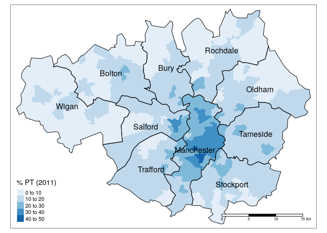
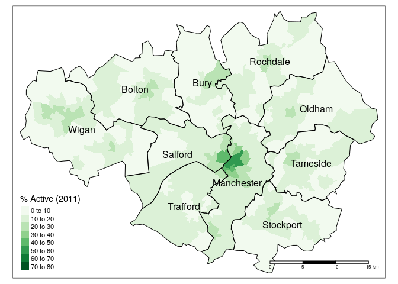
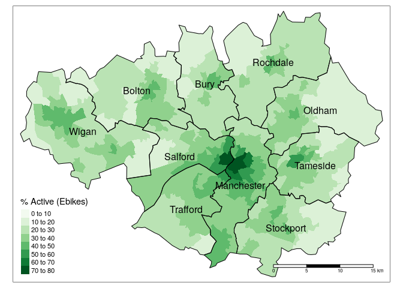
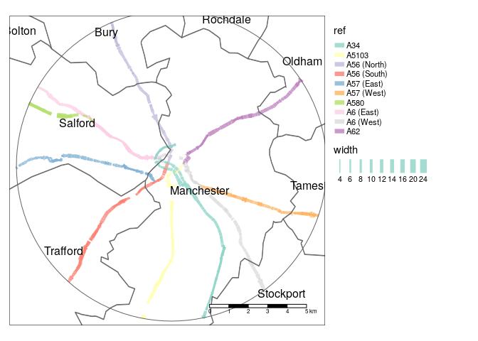
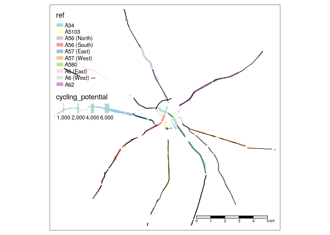
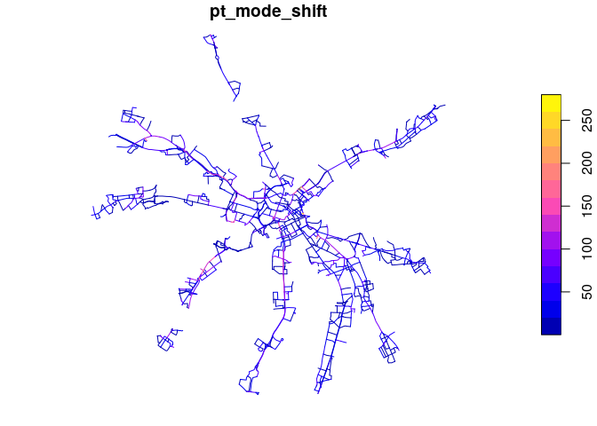

Analysis of cycling potential around key corridors in Greater Manchester
================
Robin Lovelace
18/05/2020

# Context

## Public transport

Greater Manchester has high cycling potential and high reliance on
public transport (PT) . Across the region overall, 14.3% of commutes
were made by public transport in 2011, although the reliance on public
transport varies substantially across the region. Around a third of
trips are made by PT in many parts of Manchester and Salford, as shown
in Figure <a href="#fig:pt">1</a>. These areas that are particularly
vulnerable to reduced capacity by public transport also tend to be
within cycling distance from the main employment hub in Manchester’s
city centre.

Figure 1: The percentage of trips made by public transport. Source: 2011
Census

## Active transport

The geographic distribution of active transport (walking and cycling)
for commuting is shown in Figure <a href="#fig:active">2</a>. 13% of
single mode commutes were made by active modes in 2011. This has the
potential to more than double to 33% for the region overall under the
Ebikes scenario, represented in Figure <a href="#fig:activedutch">3</a>.

Figure 2: Percentage of commutes in Greater Manchester by active
transport. Source: 2011 Census

The majority of potential growth in active transport comes from cycling
due to the increased range of commutes by this mode, around 5 km for
most people and further for many, due to high fitness and use of
e-bikes.

Figure 3: Percentage of commutes in Greater Manchester by active
transport under the Ebikes scenario. Source: Propensity to Cycle Tool

Like surrounding regions, only 2% of single mode commutes in were made
by bike according to data from the 2011 Census (this figure will be
higher, perhaps doubling since the introduction of pro-cycling policies
since 2011 and the uptake of cycling in response to PT capacity
restrictions).

Under the Ebikes scenario, this rises to 22%, compared with 20% in
Lancashire and Cheshire, with a geographic distribution shown in Figure
<a href="#fig:cycling">4</a>. The region has high cycling potential
because of the high population density in the region and relatively
short average trip distances.

Figure 4: Mode share of cycling from the 2011 Census and under the
Ebikes scenario in the Propensity to Cycle Tool

Data on walking, cycling and PT levels from the 2011 Census for MSOA
zones in the region are summarised by local authority in the table
below.

<!-- -->

# Corridor analysis

We constrained the analysis to 10 key corridors. These provide access to
the main employment hub from the North, East, South and West, as
illustrated in Figure <a href="#fig:corridors">5</a>.

Figure 5: Key corridors in Greater Manchester by road reference and
direction relative to Manchester city centre.

To further focus the analysis, only the sections within 8 km of
Manchester city centre were included. The results of clipping key
corridors to an 8 km buffer surrounding the city centre are shown in the
Figure <a href="#fig:buff8">6</a>.

Figure 6: Illustration of the key corridors within an 8 km buffer of
Manchester city centre, with the width of road line segments
proportional to estimated carriageway width. Source: www.cyipt.bike.

# Cycling potential on key corridors

The cycling potential under the E-bike scenario was assessed as follows:

| ref         | Length (m) | Cycling potential | Width (m) | Km/day |
| :---------- | ---------: | ----------------: | --------: | -----: |
| A34         |      18546 |              1552 |        10 |  57566 |
| A5103       |      14520 |              1638 |        10 |  47568 |
| A56 (South) |      13313 |              1531 |        11 |  40764 |
| A6 (West)   |      10579 |              1666 |        10 |  35250 |
| A57 (East)  |      10929 |              1545 |        10 |  33770 |
| A56 (North) |       9826 |              1467 |        10 |  28830 |
| A6 (East)   |      12718 |               979 |        11 |  24902 |
| A62         |      10544 |              1150 |        11 |  24252 |
| A57 (West)  |       9756 |               933 |        11 |  18204 |
| A580        |       5238 |               357 |        11 |   3740 |

Table 1: Average cycling potential, width and potential distance cycled
per day for commuting (to and from work on a typical work day) for each
corridor under the Ebikes scenario.

Many of the key corridors have spare lanes during times of low traffic,
as shown in Figure <a href="#fig:nlanes">7</a>, which also shows the
variability of cycling potential in segments along the different
corridors.

Figure 7: Illustration of spare lanes on key corridors

Cycling potential can also be estimated in terms of the number of new
cycling trips that could result from a mode shift to cycling. Results of
the shift from PT under the E-bikes scenario, which were calculated at
the route segment level for the first time in this study, are shown for
each key corridor in Figure <a href="#fig:shift">8</a>:

Figure 8: Cycling potential associated with a PT/cycling mode shift
under the Ebikes scenario at the route network level within 500 m of
each corridor, under the (unmet) assumption that every mode has equal
chance of being replaced by cycling for a given origin-destination pair.
In practice, the probability of a trip being replaced by cycling is mode
and context-dependent, with physical distancing rules making a
PT/cycling switch proportionally more likely.

The results from this dataset will be used to assess cycling potential
from a PT perspective, with results shown below.

| ref         | Km/day |
| :---------- | -----: |
| A5103       |  12512 |
| A6 (East)   |   9485 |
| A56 (South) |   7349 |
| A6 (West)   |   6978 |
| A34         |   6599 |
| A62         |   6581 |
| A56 (North) |   5082 |
| A57 (East)  |   3741 |
| A57 (West)  |   2829 |
| A580        |   1180 |

Table 2: Ranking of corridors according to estimated distance of PT
trips that switch to cycling within a 500m buffer of each corridor.
