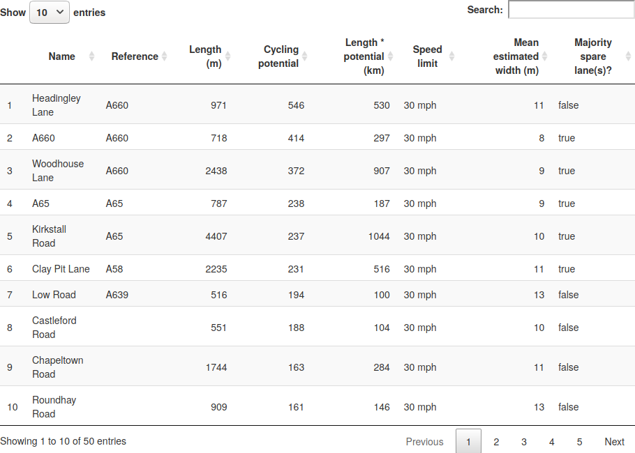
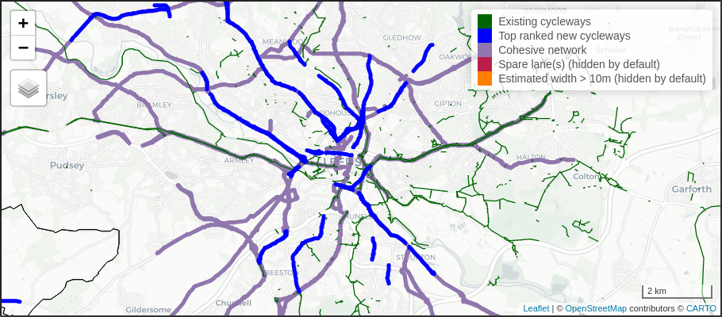

```{r, eval=FALSE, echo=FALSE}
citr::tidy_bib_file("~/uaf/allrefs.bib", rmd_file = "report.Rmd", file = "report-refs.bib")
citr::tidy_bib_file("article.Rmd", "~/uaf/allrefs.bib", file = "article-refs.bib")
browseURL("report.pdf")
browseURL("report.docx")
```

```{r setup2, include=FALSE}
knitr::opts_chunk$set(echo = FALSE, fig.align = "center", out.width = "100%")
```

&nbsp;

&nbsp;

&nbsp;

```{r park-lane, fig.cap="New space for cycling created by road space reallocation in Park Lane, London.", out.width="80%"}
# source: Hillingdon and Uxbridge Times
# https://www.hillingdontimes.co.uk/news/national/18450461.one-londons-prestigious-roads-gets-cycle-lane-due-pandemic/
knitr::include_graphics(c(
  "figures/cycleway-image.jpg"
  ))
```


# Introduction

New statutory guidance and funding for active transport infrastructure was announced by the Secretary of State for Transport on May 9^th^, to support the UK's response to the COVID-19 crisis by enabling healthy and safe travel at a time of reduced capacity on public transport networks.^[
https://www.gov.uk/government/publications/reallocating-road-space-in-response-to-covid-19-statutory-guidance-for-local-authorities/traffic-management-act-2004-network-management-in-response-to-covid-19
]

The statutory guidance on network management in response to COVID-19 outlines a range of measures that can support a safe and healthy restart, including the creation of new cycleways, reducing speed limits, widening of footways and closing roads to motor traffic via 'modal filters'.
The focus of this report is a tool that provides evidence in support of the first of these measures.
**The Rapid Cycleway Prioritisation Tool aims provide evidence on where to prioritise cycleways created by reallocating road space.**
<!-- Light segregation infrastructure such as flexible plastic wands (illustrated in Figure 1) and bollards can deliver a step change in provision for cycling, when implemented in combination with other measures such reduced speed limits on key corridors (as has happened on the A33 in Southampton and the A56 in Manchester) and when placed where they are most needed. -->

<!-- 17:29:01	 From Gill M (Manchester cyclist) : Trafford is planning to reduce speeds on Bridgewater Way element of A56 when the pop up lane goes in there “OneTrafford tweeted that work is continuing to add pop up cycle lanes along Cornbrook Road and Warwick Road in Stretford too, with temporary 30mph speed limit imposed along Bridgewater Way.” Source (https://www.messengernewspapers.co.uk/news/18489349.cyclists-praise-pop-up-cycle-lanes-along-a56-trafford/) -->


<!-- https://twitter.com/doddyuk/status/1267146449227255808 -->
<!-- The purpose of the tool is to help identify such key corridors, ensuring that funds from the Emergency Active Travel Fund change the status quo of urban and rural transport systems in favour of active travel. -->

The Emergency Active Travel Fund allocated £225m for new infrastructure in two [tranches](https://www.transportxtra.com/publications/local-transport-today/news/65661/dft-releases-first-45m-of-250m-fund/):

- The first tranche: £45m allocated for swift interventions for which applications were submitted by authorities on 5^th^ June.
- The second tranche: £180m will be released later in the summer for permanent measures

The [Rapid Cycleway Prioritisation Tool](https://www.cyipt.bike/rapid/), supported by the Department for Transport and Sustrans, was designed to provide evidence in support of schemes eligible for the second tranche of funding.
The tool provides a national evidence base that, used alongside other sources of evidence, and help ensure that the funding is spent effectively, to maximise cycling uptake in the coming and months and years of the post COVID-19 world.

\newpage

# Methods

The approach was designed to identify roads and road segments where investment in new cycleways should be prioritised using a transparent methodology and nationally consistent datasets, alongside planning authority expertise and local knowledge.
Strong and actionable datasets already exist to support strategic cycle network planning, notably the Propensity to Cycle Tool (PCT), a national planning support system.
The PCT is already used by local authorities and contains key data showing not only current levels of cycling but also scenarios of growth in usage of cycling for everyday trips (for commuting and school travel).
The scenarios include Government Target, which represents a doubling the number of cycling stages made by 2025 [@departmentfortransport_cycling_2017].
The PCT maps cycle uptake at area, route and route network levels, for commuting and (since May 2019) school travel [@goodman_scenarios_2019].

The PCT takes little account of existing infrastructure: variables such as road width and even the presence/absence of cycle infrastructure are not included in the results, with the focus being on where there is most latent demand for cycling.
The Rapid Cycleway Prioritisation Tool overcomes this issue from the perspective of planners who need to prioritise scheme candidates from hundreds of potential options.
It does this by using road network data which includes geographic attributes and cycle infrastructure from OpenStreetMap [@barrington-leigh_world_2017].
Carriageway width data were taken from the Cycling Infrastructure Prioritisation Tool (CyIPT) project, funded as a prototype project by a DfT Transport-technology research innovation grants (T-TRIG).

Among the wide range of locations where new cycleways could be implemented, the Rapid Cycleway Prioritisation Tool identifies roads which can accommodate new cycleways whilst maintaining 2-way motorized traffic.
Of these roads, it identifies priority locations for new cycleways that have the highest 'cycling potential' under the 'Government Target' scenario in the PCT [@lovelace_propensity_2017].
By cycling potential we mean the number of oneway trips that could be expected if cycling levels double, based on the distances and hilliness of routes between [origin-destination pairs](https://docs.ropensci.org/stplanr/articles/stplanr-od.html).

The main output of the tool is ranked lists of continuous road sections to support the prioritisation process.
Roads can also be ranked by cycling potential, length, speed limit and presence of spare lanes.
Length was included on the basis that interventions on long, continuous road sections will tend to have a large impact on the overall transport network.
Road sections can also be ranked by estimated amount of cycling in units of 'km per day', which is simply cycling potential multiplied by section length, as illustrated in Figure \@ref(fig:rank) (see Figure \ref(fig:mapout)).

```{r rank, fig.cap="Illustration of the tabular output of the Rapid Cycleway Prioritisation Tool for West Yorkshire."}

```

The rationale was to provide interactive evidence that supports scheme prioritisation based on a range of variables.
Length, for example, is important for creating a joined-up and continuous, a vital component of cycling strategies [@parkin_designing_2018].

## Road attribute data

At a time of reduced travel, fewer lanes dedicated to motor traffic are needed.
Based on this observation, we defined roads with a 'spare lane' as those on which there is more than one lane in either direction.
This definition assumes no reduction in mobility for motor vehicles (making two-way streets one-way is another option not explored in this analysis).

The tool highlights roads that have sufficient space for new infrastructure, by which we mean either having more than one lane in either direction *or* an average estimated width of more than 10 metres.
There are three main reasons for this focus on roads with 'spare space':

- It is possible to rapidly implement new cycleways on wide roads through a range of interventions, including light segregation along one or both sides of the road or point closures. There is a window of opportunity to get people cycling and the creation of cycleways by road space reallocation on wide roads with high cycling potential is one of the fastest and most effective ways to maximise mode switch to cycling during the 'restart'.
- Wide roads tend to be direct, continuous and located along strategic corridors, where cycling potential (including cycling trips replacing trips previously made by public transport) is likely to be highest.
- The cycleways resulting from space reallocation on such roads are likely to be sufficiently wide, continuous and direct to enable large numbers of people to switch to cycling while observing physical distancing guidelines, potentially reducing pressure on public transport on strategic corridors.

<!-- To identify road sections on which there is a spare lane we developed a simple algorithm that takes the OSM variable [`lanes`](https://wiki.openstreetmap.org/wiki/Key:lanes) if it is present and, if not, derives the number from the highway type and presence/absence of bus lanes. -->
We defined roads with 'spare lanes' as those on which there was at least 2 lanes (including bus lanes) going in the same direction, based on data from [OpenStreetMap](https://www.openstreetmap.org).
We also included estimates of road width, only flagging roads with an average estimated width of more than 10 m using data that had previously been generated for the Cycling Infrastructure Prioritisation Tool.
10 m was selected because it is roughly the minimum width required for new cycleways created by road space reallocation measures, although there are examples of roads that are less than 10 m on which new cycleways have been successfully created in response to COVID-19.^[
[South Road](https://www.lancasterguardian.co.uk/news/uk-news/mixed-reactions-new-lancaster-pop-cycle-lanes-busy-city-centre-road-2875909#gsc.tab=0) in Lancaster, for example, has an average width of around 9 m, yet protected cycleways in either direction have been created by installation of wands on either side.
]
The tool does not account for space currently occupied by on street parking, verges and pavements, which could provide additional space for cycling interventions.

<!-- Usingcould increase the effective available space for new cycleways, and the presence of vehicle parking bays, and on street parking which reduce it. -->

<!-- All segments defined as having a spare lane using this method are shown in Figure \@ref(fig:levels) (left). -->

## Grouping and filtering of road segments

<!-- For our three core outputs of near-term cycleway prioritisation, we follow a series of grouping and filtering steps, to identify roads that have both high cycle potential and available road space.  -->
<!-- Segments are grouped by their road reference number, with stricter filtering criteria for roads with no reference number, to avoid a mass of short road segments on side streets.  -->
<!-- We use a 100m buffer to further group these segments, as shown in Figure \@ref(fig:levels) (middle and right, respectively), which shows that grouping nearby road segments before filtering results in a more cohesive network.  -->

<!-- We then remove groups which do not have either an estimated mean road width of at least 10m or a spare lane for the majority of their length.  -->
<!-- Groups with mean cycling potential below a minimum threshold are also removed. This threshold varies according to cycling levels in each region.  -->
<!-- Finally, any segments not part of a wider group of > 500m length (using a 100m buffer) are removed. -->

```{r levels, out.width="90%", fig.cap="Illustration of the 'group then filter' method to identify long sections with spare lanes *and* high cycling potential"}
# knitr::include_graphics("figures/filter-then-group.png")
```

## Top ranked new cycleways

To identify wide and continuous roads with high cycling potential we first excluded roads with low cycling potential from the analysis.

Roads with high cycling potential but insufficient width were excluded from the 'Top ranked new cycleways' layer but were included in the 'Cohesive network' layer, described in the next section and on the tools main web page at [www.cyipt.bike/rapid](https://www.cyipt.bike/rapid/#map-layers).

Only roads with a continuous length above a threshold distance (500 m) identified as candidates for inclusion in the Top ranked new cycleways layer. 
Roads with an existing cycleway along 75% or more of their length were excluded (we selected such a high value because the presence of a cycleway in OSM does not guarantee that this is a high quality, continuous route).
Roads were ranked in terms of their cycling potential and highest ranking roads were included in the roads.
The number of roads identified as Top ranked new cycleways varies depending on the size of the authority, ranging from 4 in the [Isle of Wight](https://www.cyipt.bike/rapid/isle-of-wight/) to 80 in [Greater London](https://www.cyipt.bike/rapid/greater-london/).

## Cohesive network

The Cohesive network layer was derived using a different method from the other layers. 
To identify this network, we selected 'through traffic' roads, primarily A roads and B roads, that had high cycling potential (in the 85th percentile or above for all roads in the authority) on some or all of their length. 
We then join together these segments together to form a coherent network.
<!-- using a 1000m buffer -->
The resulting layer shows what a joined up cycle network could look like if new cycleways were placed along corridors of high potential, by either closing roads to motorised traffic or creating one-way systems.

## Roads with spare space

Roads that met the spare space criteria but which were not selected as top routes were kept and can be shown in the layers named 'spare lane' and 'estimated width >10m'.
This includes roads with high cycling potential but which were not selected as top routes because they do not keep the same name for a stretch of at least 500 m in length.
These results are hidden by default to simplify the visualisation of results and to focus attention on the most important results, including the Cohesive network.
They represent roads on which there is more than one lane in one direction, and roads with an estimated carriageway width of 10 m or more, respectively.
They can be visualised in the map by clicking on the layers button in the top lefthand corner of the map.

## Feedback from stakeholders

We elicited feedback from stakeholders via the Basecamp forum for authority transport planners.
As a result of the feedback we made a few adjustments to the results:

- We refined the road identification method, to highlight more roads close to city centres, in response to feedback suggesting that some of the road sections went too far into the countryside.
- We changed the legend of the basemap, so that the layers were presented in time order: Existing cycleway (now); Top ranked new cycleways (near term); Cohesive network (long term).
- We added a column showing current speed limits on road sections, highlighting safety issues around potential routes and encouraging consideration of speed limit reductions along strategic corridors with high cycling potential.
- We updated the description and framing of the tool to clarify the limitations of the data and its intended use.

# Outputs

The results of this research are publicly accessible at www.cyipt.bike/rapid. 
The main output is a list of candidate roads that meet the 'spare space' criteria outlined above, presented in tabular form in Figure \@ref(fig:rank) above.
From a planning perspective the most useful output is an interactive map of a type shown in Figure \@ref(fig:mapout).
Results are available for regions covering the whole of England, at the level of Combined Authorities, Unitary Authorities, or Upper Tier Authorities. 

```{r mapout, fig.cap="The map output of the Rapid Cycleway Prioritisation Tool for West Yorkshire, zoomed in on Leeds"}

```


In addition to a list of highlighted road sections, a number of outputs were generated for each authority.
These are represented as layers in the interactive map, and ordered chronologically, with the aim of making the results more intuitive.
For the immediate task of joining-up existing cycleways, for example, the Existing cycleways layer may be of most use.
The Cohesive network provides a long-term 'direction of travel' that could be used to support a longer term strategic vision, in support of Local Cycling and Walking Plans (LCWIPs).
These are other layers are described below.

## Existing cycleways

The first layer shows existing off-carriageway cycleways are segregated from motor traffic (it does not include painted cycle lanes).
The quality of the cycle paths is not reported in the data and the presence of a cycleway cannot guarantee that there is adequate provision, because some cycleways included in this dataset are of poor quality and/or are on paths shared by pedestrians that have limited capacity for high cycle traffic while observing physical distancing guidelines.
Also, because of the variable time lag between new cycleways being built and their appearance on OSM, not all existing cycleways are included in this layer (although most established cycleways in most areas are).
The data was accessed from OpenStreetMap in May 2020 so is up-to-date in many areas.

The Existing cycleways layer highlights the importance of planning new infrastructure in reference to existing networks or routes, which have not yet been joined up to form a cohesive network in most cities.
New interventions, including new cycleways created by reallocating space on strategic corridors with sufficient space, identified in the next layer, should be prioritised based on their ability to improve cycle network cohesion.


## Near term: Top priorities for road space reallocation

Three layers show the roads we have identified as candidates for road space reallocation. These roads have both high cycling potential and available space. They also meet criteria for length and continuity. 

Named roads with the highest cycling potential are ranked and selected as top routes. For the remaining roads, we identified whether they have a spare lane for the majority of their length, or an estimated mean width >10m.
The resulting layers, are hidden by default, were used to help identify where 'connecting' cycleway sections' that have spare space but do not meet the criteria for inclusion in the 'top routes' layer that could help form part of a cohesive network.

## Long term: Cohesive network

The final layer represents a cohesive network of cycle routes along the most important road corridors in each region.
It allows visualisation of what a joined-up cycle network would look like, without considering road capacity constraints.

This provides the ability to identify roads that may be key priorities today for cycle infrastructure, but which are missing from the other results, either due to the limitations of our road attribute data, or because the roads are simply too narrow to show up in the other results. 
Interventions may still be possible on narrow roads, for example the removal of central line markings has been shown to reduce average vehicle speeds [@shackel_influence_2014]. 
In other cases, it may be possible to convert a two-way road to one-way working and re-allocate the space previously occupied by one of the traffic lanes to bi-directional cycleways, as happened in a successful Experimental Traffic Regulation Order (ETRO) intervention in Torrington Place, [Cambden](https://www.camden.gov.uk/documents/20142/18667687/14-1+-+Licensed+Taxi+Drivers%27+Association+%28LTDA%29.pdf/20bc7ead-5ccc-13ed-66f4-e713eee4e103).

Finally, the cohesive network can help identify gaps in existing and/or proposed cycle infrastructure. 
'Gappy' networks are off-putting to many cyclists, and busy or complex road junctions in particular can create barriers to cycle movement [@buehler_bikeway_2016].

## Road space layers

In addition to the layers mentioned above, two other layers are available in the map: Spare lane(s) and Estimated width > 10 m layers.
These layers, which are hidden by default, do not meet the cycling potential or length criteria needed for inclusion in the top ranked routes.
They were included in the map to highlight routes where 'connecting' infrastructure joining existing infrastructure or routes to destinations not picked up in the PCT, may be appropriate.

# Limitations and known issues

The approach is not without limitations.
Its reliance on data rather than community engagement represents a rather top-down approach to transport planning, meaning that the results should be sense-checked by people with local knowledge and feedback from stakeholders where timescales permit.

Participatory maps are one way to crowd source such stakeholder feedback, as shown in Figure \@ref(fig:widenmypath).
The data from the tool could also feed into such participatory tools.

```{r widenmypath, out.width="100%", fig.cap="widenmypath.com, an example of participatory tools to support prioritisation of new active transport infrastructure, including new cycleways. The open data provided by the project could be overlaid to encourage community feedback on promising options highlighted by our tool."}
knitr::include_graphics("figures/widenmypath-bristol.png")
```


The datasets used also have limitations.
As with any dataset, the OpenStreetMap (OSM) data on which the estimates of road width and number of lanes are based is not a perfect representation of the real world.
OSM data is contributed by the OSM community and continuously improving so represents a future-proof and easy-to-update solution [@barrington-leigh_world_2017].
To the best of our knowledge OSM is also the richest national source of combined cycleway *and* road network data in the UK (and most countries) that is open access and free from licensing restrictions.^[
We are in discussion with the Ordnance Survey and the Department for Transport about ways to include some of their additional datasets in future transport planning tools.
]
However, it is important to understand the limitations of OSM data when using the tool.
OSM data is better in some places than others, the geometry is not always accurate, and the data model makes some simplifying assumptions (shared use paths without high quality surfaces can be labelled as cycleways, for example).

It is important to remember that the Cycleway Prioritisation Tool focuses on only one aspect of the wider planning process.
It focusses attention on the important question of road space reallocation on strategic corridors with high cycling potential.
This focus on strategic corridors has advantages but could also be seen as a limitation: road space reallocation is only one part of the range of interventions needed to get people cycling.

The tool should be used alongside other sources of evidence and alongside plans for other types of intervention, outlined in new [statutory guidance](https://www.gov.uk/government/publications/reallocating-road-space-in-response-to-covid-19-statutory-guidance-for-local-authorities).
In urban and residential areas, other interventions include use of modal filters, point closures of roads, traffic calming, and making roads oneway for motor traffic.
Future work could help prioritise modal filters to prevent 'rat-running', enhance filtered permeability, and create Low Traffic Neighbourhoods.
For longer journeys, park-and-cycle schemes can solve 'last-mile' problems and cut congestion.
Other tools could be developed to support such broader interventions, perhaps partly building on our work (the methods of which are open and modular and therefore extendible).

As stated above, OpenStreetMap data on does not give comprehensive coverage in all parts of the country. 
The Cohesive network layer was developed to mitigate the disjointed nature of roads with spare space, but this layer does not include potential new routes outside the current road network.

The methodology only selects roads that have the same name for a continuous stretch of at least 500m, as candidates for top routes, meaning that some roads will be excluded from the 'top routes' result due to name changes (although most continuous road sections have consistent names).
To mitigate this limitation, roads that don't meet this criteria can still appear in the 'spare lane' and 'estimated width > 10m' layers. 
Dual carriageways lengths are currently counted twice, meaning a dual carriageway section of 260 m may be included in the results.

Vehicular traffic volumes may restrict the potential for road space reallocation, and the presence of on-street car parking may prevent the use of particular alignments. 
While we do not account for this, the reduction in traffic due to COVID-19 has brought about both a unique opportunity and an urgent necessity to change travel patterns and behaviours in profound ways.
As an example of the changes are happening right now, Glasgow has recently suspended around a third of its on-street parking spaces, to widen pavements and increase space for social distancing.

The tool cannot account for such nuanced policy responses or, currently, distinguish between design options.
After a network of routes has been identified using a range of sources of evidence, including this tool, a number of other policy and design decisions need to be made, that are beyond the scope of this tool.
Overall, interventions will be most effective where they form part of a wider transport policy and where measures can be adopted long-term.

The coming 'restart' will lead to long lasting changes in transport systems.
The changes could include a worsening of air pollution, congestion and road traffic casualty rates.
Alternatively, the restart could involve continued uptake of active transport.
The Rapid Cycleway Prioritisation Tool provides an evidence base in support of effective and timely interventions that can help ensure a healthy, safe restart to the transport system that future proofs it for the demands the 21^st^ Century.


# Next steps

This tool has been developed rapidly to support rapid decision making, and there are many promising potential future directions of travel, including:

- Integration with tools for community consultation.
- Use of new datasets such as traffic volumes (available as 'AADT' counts on many major roads as open data), road casualty data and more exotic datasets such as passively collected movement data from smartphone applications (pending data availability).
- Inclusion of 'supply side' considerations such as materials (e.g. wands and orcas), specific design options (as demonstrated with the original CyIPT project), and engineering constraints. 
- Inclusion of additional trip purposes in estimates of cycling potential, that may require updates to or extensions of the Propensity to Cycle Tool.

Perhaps the most promising future direction of travel is towards more flexible tools for transport planning.
By demonstrating how existing datasets can be combined to create new results that are useful, the project has shown that, like infrastructure planning itself, an 'agile' approach to transport planning tools can yield useful and perhaps unexpectedly successful results that support local knowledge and transport planning expertise.
We hope to take lessons learned during the project forward into future, more strategic, transport planning tool research and development work.

# Acknowledgments

Many thanks to Dr Malcolm Morgan ([University of Leeds](http://www.leeds.ac.uk/)) and Martin Lucas-Smith ([CycleStreets.net](https://www.cyclestreets.net/)) for providing substantial input into methodological and web development aspects of the project respectively.

Thanks to Jeremy Clarke, Rabina Nawaz, John Sweetman and Richard Mace from the [Department for Transport](https://www.gov.uk/government/organisations/department-for-transport) for vital input into the tool's design.
Thanks to Kevin McCann from [Sustrans](https://www.sustrans.org.uk/) for guidance that improved the tool from a policy perspective.
Thanks to Roger Geffen and others from [CyclingUK](https://www.cyclinguk.org/) for input into prototype versions of the tool.
Thanks to developers of open source software, especially to [contributors](https://www.r-project.org/contributors.html) to the R language in which most of the data analysis was conducted.
Thanks also to all the contributors to OpenStreetMap who provided open data on which much of the analysis was based, allowing publication of the results as open data under the conditions of the Open Data Commons Open Database License ([ODbL 1.0](https://www.openstreetmap.org/copyright)). Data (c) [OpenStreetMap](https://www.openstreetmap.org) contributors.


# References

