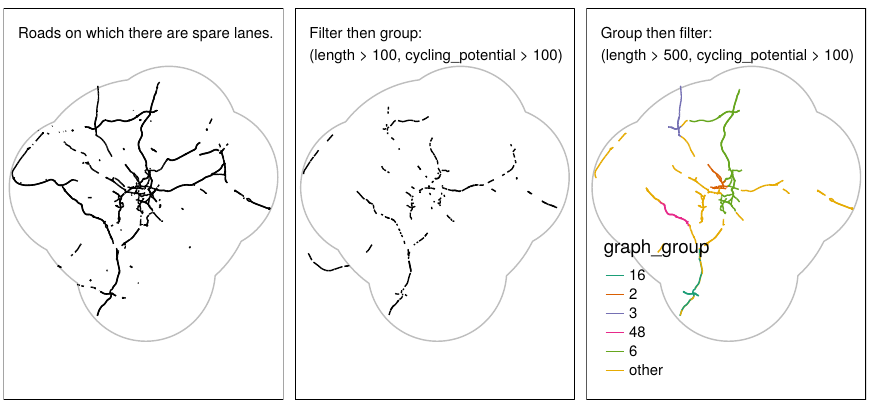
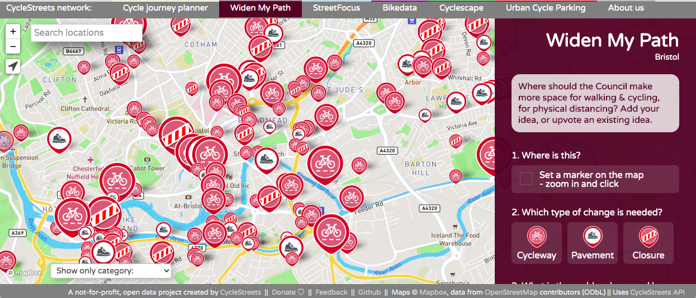

```{r, eval=FALSE, echo=FALSE}
citr::tidy_bib_file("~/uaf/allrefs.bib", rmd_file = "report.Rmd", file = "report-refs.bib")
citr::tidy_bib_file("article.Rmd", "~/uaf/allrefs.bib", file = "article-refs.bib")
browseURL("report.pdf")
```

```{r setup2, include=FALSE}
knitr::opts_chunk$set(echo = FALSE, fig.align = "center")
```

&nbsp;

&nbsp;

&nbsp;

```{r park-lane, fig.cap="New space for cycling created by road space reallocation in Park Lane, London.", out.width="80%"}
# source: Hillingdon and Uxbridge Times
# https://www.hillingdontimes.co.uk/news/national/18450461.one-londons-prestigious-roads-gets-cycle-lane-due-pandemic/
knitr::include_graphics(c(
  "figures/cycleway-image.jpg"
  ))
```


# Introduction

New statutory guidance and funding for active transport infrastructure was announced by the Secretary of State for Transport on May 9^th^, to support the UK's response to the COVID-19 crisis by enabling healthy and safe travel at a time of reduced capacity on public transport networks.^[
https://www.gov.uk/government/publications/reallocating-road-space-in-response-to-covid-19-statutory-guidance-for-local-authorities/traffic-management-act-2004-network-management-in-response-to-covid-19
]

The statutory guidance on network management in response to COVID-19 outlines a range of measures that can support a safe and healthy restart, including the creation of new cycleways, reducing speed limits, widening of footways and closing roads to motor traffic via 'modal filters'.
**This report describes the rapid cycleway prioritisation tool project, which provides aims to ensure evidence-based and effective investment in first of these measures: the creation of new cycleways in existing carriageway space reclaimed from motor traffic.**
Light segregation infrastructure such as flexible plastic wands (illustrated in Figure 1) and bollards can deliver a step change in provision for cycling, when implemented in combination with other measures such reduced speed limits on key corridors (as has happened on the A33 in Southampton and the A56 in Manchester) and when placed where they are most needed.
**The purpose of the tool is to help identify such key corridors, ensuring that funds from the Emergency Active Travel Fund change the status quo of urban and rural transport systems in favour of active travel.**

<!-- 17:29:01	 From Gill M (Manchester cyclist) : Trafford is planning to reduce speeds on Bridgewater Way element of A56 when the pop up lane goes in there “OneTrafford tweeted that work is continuing to add pop up cycle lanes along Cornbrook Road and Warwick Road in Stretford too, with temporary 30mph speed limit imposed along Bridgewater Way.” Source (https://www.messengernewspapers.co.uk/news/18489349.cyclists-praise-pop-up-cycle-lanes-along-a56-trafford/) -->


<!-- https://twitter.com/doddyuk/status/1267146449227255808 -->

The £250m released by the Emergency Active Travel Fund will be spent in three broad [ways](https://www.transportxtra.com/publications/local-transport-today/news/65661/dft-releases-first-45m-of-250m-fund/):

- The first tranche: £45m released on 1^st^ June, is for swift interventions that must be implemented by the end of June
- The second tranche: £180m will be released later in the summer for more permanent measures
- £25m will be invested in cycle repair schemes

The emphasis of the evidence presented in this report is providing a strong evidence base to prioritisation of schemes eligible for the second tranche.
However, the evidence could also be used to support identification of schemes for the first tranche, such as reallocation of road space on arterial routes, where decisions have not yet been made.

Given the importance of acting quickly, and the unique opportunity that the crisis poses to improve physical activity levels in the long term, it is vital that local authorities have the evidence they need.
Without a nationally consistent and systematic evidence base, there is a risk that some already stretched local authorities will rely on ad-hoc methods to allocate funding.
The rapid cycleway prioritisation tool can also support authorities to make bold plans by highlighting the potential of key strategic corridors.

\newpage

# Methods

The approach was designed to identify roads and road segments where investment in new cycleways should be prioritised using a transparent methodology and nationally consistent datasets, alongside local authority expertise and local knowledge.
Strong and actionable datasets already exist to support strategic cycle network planning, notably the Propensity to Cycle Tool (PCT), a national planning support system [@lovelace_propensity_2017].
The PCT is already used by local authorities and contains key data showing not only current levels of cycling but also scenarios of growth, notably the Government Target scenario of doubling the number of cycling stages made by 2025 [@departmentfortransport_cycling_2017].
The PCT maps cycle uptake at area, route and route network levels, for commuting and school travel (as of May 2020) [@goodman_scenarios_2019].

A limitation of the PCT is that it takes little account of existing infrastructure: variables such as road width and even the presence/absence of cycle infrastructure currently are not included in the results.
The rapid cycleway prioritisation tool overcomes this issue by using road network data which includes geographic attributes and cycle infrastructure from OpenStreetMap.
Carriageway width data were taken from the Cycling Infrastructure Prioritisation Tool (CyIPT) project, funded as a prototype project by a DfT Transport-technology research innovation grants (T-TRIG).
This uses road data derived from OpenStreetMap.org (OSM) [@barrington-leigh_world_2017].

The rapid cycleway prioritisation tool is based on levels of cycling potential *and* road attribute data, with an emphasis on road space reallocation.
The method was parameterised to highlight roads that have sufficient space to allow for new cycleways without affecting the navigable network for motorised modes [@lovelace_methods_2020].
A benefit of this method is that it allows continuous road sections to be identified and ranked, supporting prioritisation of investment.
Roads can be ranked based not only on cycling potential, but also based on continuous road length and estimated cycle usage measured in km per day.
The tool highlights continuous road sections with high cycling potential in the context of existing infrastructure on the basis that new infrastructure should maximise cycle network cohesion and continuity [@parkin_designing_2018].

## Road attribute data

At a time of reduced travel, fewer lanes dedicated to motor traffic are needed.
Based on this observation, we defined roads with a 'spare lane' as those on which there is more than one lane in either direction.
This definition assumes no reduction in mobility for motor vehicles (making two-way streets one-way is another option not explored in this analysis).

To identify road sections on which there is a spare lane we developed a simple algorithm that takes the OSM variable [`lanes`](https://wiki.openstreetmap.org/wiki/Key:lanes) if it is present and, if not, derives the number from the highway type and presence/absence of bus lanes.
All segments defined as having a spare lane using this method are shown in Figure \@ref(fig:levels) (left).
We also included estimates of road width, only flagging roads with an average estimated width of more than 10m (the minimum that should be considered for cycleways without additional changes).
In future, this methodology could be enhanced to include verge and pavement width estimates, which could increase the effective available space for new cycleways, and the presence of vehicle parking bays, and on street parking which reduce it.

## Grouping and filtering of road segments

For our three core outputs of near-term cycleway prioritisation, we follow a series of grouping and filtering steps, to identify roads that have both high cycle potential and available road space. 
Segments are grouped by their road reference number, with stricter filtering criteria for roads with no reference number, to avoid a mass of short road segments on side streets. 
We use a 100m buffer to further group these segments, as shown in Figure \@ref(fig:levels) (middle and right, respectively), which shows that grouping nearby road segments before filtering results in a more cohesive network. 

We then remove groups which do not have either an estimated mean road width of at least 10m or a spare lane for the majority of their length. 
Groups with mean cycling potential below a minimum threshold are also removed. This threshold varies according to cycling levels in each region. 
Finally, any segments not part of a wider group of > 500m length (using a 100m buffer) are removed.

```{r levels, out.width="90%", fig.cap="Illustration of the 'group then filter' method to identify long sections with spare lanes *and* high cycling potential"}

```

## Selection of top routes

From the results of the previous steps, we can now select the top routes for cycling. 
Only roads that have the same name for a continuous stretch of at least 500m are eligible for selection as a top route. 
Roads cannot be candidates for top routes if there is an existing cycleway along 75% or more of their length. 
We selected such a high value because the presence of a cycleway in OSM does not guarantee that this is a high quality, continuous route.
Top routes are ranked according to their cycling potential.

Roads not selected as top routes are shown in the layers named 'spare lane' and 'estimated width >10m.'

## Identification of cohesive cycle network

The cohesive network is derived using a different method from the other layers. 
To identify this network, we select road segments on the trunk road, A road and B road network that have cycling potential in the 85th percentile or above, for their region. 
We then join together these segments using a 1000m buffer, to form a coherent network.
This is thus based on the cycling potential of roads, without reference to the road width or number of lanes.

## Feedback from stakeholders

We elicited feedback from stakeholders via the Basecamp forum for local authority transport planners.
As a result of the feedback we made a few adjustments to the results:

- We refined the road identification method, to highlight more central road sections and fewer long sections far from high density areas, in response to feedback suggesting that some of the road sections went too far into the countryside.
- We simplified the legend of the basemap, so that the layers were presented in time order: Existing cycleway (now); Top ranked new cycleways (near term); Cohesive network (long term).
- We requested data from Highways England to flag the recommendations on the Strategic Road Network (SRN) and trialed adding a column to the results. Having tested the results the great majority of regions did not contain routes on the SRN. We decided to add a column showing current speed limits on road sections instead, highlighting safety issues around potential routes and encouraging consideration of speed limit reductions along strategic corridors with high cycling potential.
- We updated the description and framing of the tool to clarify the limitations of the data and its intended use.

# Outputs

The results of this research are publicly accessible at www.cyipt.bike/rapid. 
Maps are available for regions covering the whole of England, at the level of Combined Authorities, Unitary Authorities, or Upper Tier Authorities. 
Using the methods outlined above, we have derived a set of outputs which are represented as layers in these maps.
The layers are presented in chronological order to make reading the maps more intuitive, indicating that the data should be used to identify ways to fill key gaps in the existing network in the short term but also plan for a cohesive network in the long term, providing a long-term 'direction of travel' in line with Local Cycling and Walking Plans (LCWIPs), which provide a strategic vision of joined-up networks.

## Existing cycleways

The first layer shows existing off-carriageway cycleways are segregated from motor traffic (it does not include painted cycle lanes).
The quality of the cycle paths is not reported in the data and the presence of a cycleway cannot guarantee that there is adequate provision, because some cycleways included in this dataset are of poor quality and/or are on paths shared by pedestrians that have limited capacity for high cycle traffic while observing physical distancing guidelines.
Also, because of the variable time lag between new cycleways being built and their appearance on OSM, not all existing cycleways are included in this layer (although most established cycleways in most areas are).
The data was accessed from OpenStreetMap in May 2020 so is up-to-date in many areas.

The Existing cycleways layer highlights the importance of planning new infrastructure in reference to existing networks or routes, which have not yet been joined up to form a cohesive network in most cities.
New interventions, including new cycleways created by reallocating space on strategic corridors with sufficient space, identified in the next layer, should be prioritised based on their ability to improve cycle network cohesion.


## Near term: Top priorities for road space reallocation

Three layers show the roads we have identified as candidates for road space reallocation. These roads have both high cycling potential and available space. They also meet criteria for length and continuity. 

Named roads with the highest cycling potential are ranked and selected as top routes. For the remaining roads, we identify whether they have a spare lane for the majority of their length, or an estimated mean width >10m.

## Long term: Cohesive network

The final layer represents a cohesive network of cycle routes along the most important road corridors in each region.
It allows visualisation of what a joined-up cycle network would look like, without considering road capacity constraints.

This provides the ability to identify roads that may be key priorities today for cycle infrastructure, but which are missing from the other results, either due to the limitations of our road attribute data, or because the roads are simply too narrow to show up in the other results. 
Interventions may still be possible on narrow roads, for example the removal of central line markings has been shown to reduce average vehicle speeds (ref). 
As an example of cycle infrastructure on a narrow road, South Road in Lancaster is recorded on OSM as having road width <10m, yet protected cycleways are currently being constructed there (image). 
In other cases, it may be possible to convert a two-way road to one-way working and re-allocate the space previously occupied by one of the traffic lanes to bi-directional cycleways. (Torrington Place image)

Finally the cohesive network can help identify gaps in existing and/or proposed cycle infrastructure. 
Gappy networks are off-putting to many cyclists, and busy or complex road junctions in particular can create barriers to cycle movement (ref).

# Limitations and known issues

The approach is not without limitations.
Its reliance on data rather than community engagement represents a rather top-down approach to transport planning.
To overcome this issue, future work could seek to incorporate the results such as those presented above into a participatory map of the type shown in Figure \@ref(fig:widenmypath).

```{r widenmypath, out.width="100%", fig.cap="widenmypath.com, an example of participatory tools to support prioritisation of new active transport infrastructure, including new cycleways. The open data provided by the project could be overlaid to encourage community feedback on promising options highlighted by our tool."}

```


The datasets used also have limitations.
As with any dataset, the OpenStreetMap (OSM) data on which the estimates of road width and number of lanes are based is not a perfect representation of the real world.
OSM data is contributed by the community and continuously improving so represents a future-proof and easy-to-update solution [@barrington-leigh_world_2017].
To the best of our knowledge OSM is also the richest national source of combined cycleway *and* road network data in the UK (and most countries) that is open access and free from licensing restrictions.^[
We are in discussion with the Ordnance Survey and the Department for Transport about ways to include some of their additional datasets in future transport planning tools.
]
However, it is important to understand the limitations of OSM data when using the tool.
OSM data is better in some places than others, the geometry is not always accurate, and the data model makes some simplifying assumptions (shared use paths without high quality surfaces can be labelled as cycleways, for example).

An strength of the tool is it's focus on one aspect of the wider planning to support focussed attention on road space reallocation on strategic corridors.
This could also be seen as a limitation: road space reallocation should be pursued as part of a wider multi-intervention strategy, and our tool should be used alongside other sources of evidence of other types of intervention: it has a specific scope.
In urban and residential areas, other interventions such as strategic use of modal filters, road closures, traffic calming, and conversions to one-way working can be used to prevent 'rat-running', enhance filtered permeability, and create Low Traffic Neighbourhoods (image).
For longer journeys, park-and-cycle schemes can solve 'last-mile' problems and cut congestion.
Other tools could be developed to support such broader interventions, perhaps partly building on our work (the methods of which are open and modular and therefore extendible).

OSM data on does not give comprehensive coverage of road width and number of lane attributes in all parts of the country. 
The Cohesive network layer was developed to mitigate the impact of the disjointed nature of roads with spare space and the data underlying the estimation of where there is (and is not) spare space.

The methodology only selects roads that have the same name for a continuous stretch of at least 500m, as candidates for top routes.
To mitigate this limitation, roads that don't meet this criteria can still appear in the 'spare lane' and 'estimated width > 10m' layers. 

Vehicular traffic volumes may restrict the potential for road space reallocation, and the presence of on-street car parking may prevent the use of particular alignments. 
While we do not account for these limitations, the reduction in traffic due to COVID-19 has brought about both a unique opportunity and an urgent necessity to change travel patterns and behaviours in profound ways.
As an example of the changes are happening right now, Glasgow has recently suspended around a third of its on-street parking spaces, to widen pavements and increase space for social distancing.

The tool cannot account for such nuanced policy responses or, currently, distinguish between design options.
Physical protection of cycleways will improve their, but permeable barriers (such as flexible plastic wands) are preferred to solid barriers that may obstruct pedestrians from crossing the road and encourage speeding. Interventions will be most effective where they form part of a wider transport policy and where experimental measures that prove successful can be adopted long-term.
The tool is designed to inform a 'first pass' in the planning process around new emergency cycleways but deeper consideration is needed when developing strategic plans and specific designs.


# Next steps

This tool has been developed rapidly to support rapid decision making, and there are many promising potential future directions of travel, including:

- Integration with tools for community consultation.
- Use of new datasets such as traffic volumes (available as 'AADT' counts on many major roads as open data), road casualty data and more exotic datasets such as passively collected movement data from smartphone applications (pending data availability).
- Inclusion of 'supply side' considerations such as materials (e.g. wands and orcas), specific design options (as demonstrated with the original CyIPT project), and engineering constraints. 
- Inclusion of additional trip purposes in estimates of cycling potential, that may require updates to or extensions of the Propensity to Cycle Tool.

Perhaps the most promising future direction of travel is towards more flexible tools for transport planning.
By demonstrating how existing datasets can be combined to create new results that are useful, the project has shown that, like infrastructure planning itself, an 'agile' approach to transport planning tools can yield useful and perhaps unexpectedly successfull results that support local knowledge and transport planning expertise.
We hope to take lessons learned during the project forward into future, more strategic, transport planning tool research and development work.


# References

