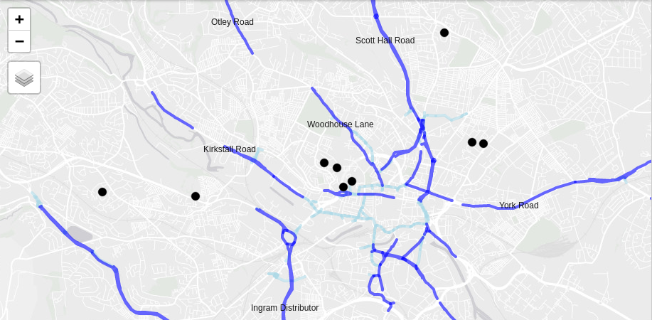

```{r, eval=FALSE, echo=FALSE}
citr::tidy_bib_file("~/uaf/allrefs.bib", rmd_file = "report.Rmd", file = "report-refs.bib")
citr::tidy_bib_file("article.Rmd", "~/uaf/allrefs.bib", file = "ref.bib")
browseURL("report.pdf")
```

```{r setup2, include=FALSE}
knitr::opts_chunk$set(echo = FALSE, fig.align = "center")
```


# Introduction

New statutory guidance and funding for active transport infrastructure was announced by the Secretary of State for Transport on May 9^th^, to support the UK's response to the COVID-19 crisis by enabling healthy and safe travel at a time of reduced capacity on public transport networks.^[
https://www.gov.uk/government/publications/reallocating-road-space-in-response-to-covid-19-statutory-guidance-for-local-authorities/traffic-management-act-2004-network-management-in-response-to-covid-19
]

The statutory guidance on network management in response to COVID-19 outlines a range of measures that can support a safe and healthy restart, including the creation of new cycleways, reducing speed limits, widening of footways and closing roads to motor traffic via 'modal filters'.
**This report describes the rapid cycleway prioritisation tool project, which provides aims to ensure evidence-based and effective investment in first of these measures: the creation of new cycleways in existing carriageway space reclaimed from motor traffic.**
Light segregation infrastructure such as flexible plastic wands (illustrated in Figure 1) and bollards can deliver a step change in provision for cycling, when implemented in combination with other measures such reduced speed limits on key corridors (as has happened on the A33 in Southampton and the A56 in Manchester) and when placed where they are most needed.
**The purpose of the tool is to help identify such key corridors, ensuring that funds from the Emergency Active Travel Fund change the status quo of city transport systems in favour of active travel.**

<!-- 17:29:01	 From Gill M (Manchester cyclist) : Trafford is planning to reduce speeds on Bridgewater Way element of A56 when the pop up lane goes in there “OneTrafford tweeted that work is continuing to add pop up cycle lanes along Cornbrook Road and Warwick Road in Stretford too, with temporary 30mph speed limit imposed along Bridgewater Way.” Source (https://www.messengernewspapers.co.uk/news/18489349.cyclists-praise-pop-up-cycle-lanes-along-a56-trafford/) -->


<!-- https://twitter.com/doddyuk/status/1267146449227255808 -->

```{r park-lane, fig.cap="New space for cycling created by road space reallocation in Park Lane, London.", out.width="60%"}
# source: Hillingdon and Uxbridge Times
# https://www.hillingdontimes.co.uk/news/national/18450461.one-londons-prestigious-roads-gets-cycle-lane-due-pandemic/
knitr::include_graphics("figures/cycleway-image.jpg")
```

The £250m released by the Emergency Active Travel Fund will be spent in three broad ways:

- £25m will be invested in cycle repair schemes
- £45m will be invested on swift interventions that must be implemented in June
- £180m will be released later in the summer for more permanent measures


Given the importance of acting quickly, and the unique opportunity that the crisis poses to improve physical activity levels in the long term, it is vital that local authorities have the evidence they need, to ensure the funding is spent where it is most needed.
Without a nationally consistent and systematic evidence base, there is a risk that already stretched local authorities rely on ad-hoc and flawed methods to allocate funding.

In this context, the aim of work outlined in this document is to identify roads and road segments where investment in new cycleways should be prioritised using a transparent methodology and nationally consistent datasets, alongside local authority expertise and local knowledge.
Strong and actionable datasets already exist to support strategic cycle network planning, notably the Propensity to Cycle Tool (PCT), a national cycling research project and planning support system [@lovelace_propensity_2017].
The PCT is already used by local authorities and contains key data showing not only current levels of cycling but also scenarios of growth, notably the Government Target scenario of doubling the number of cycling stages made by 2025 [@departmentfortransport_cycling_2017], at area, route and route network levels, for commuting and school travel (as of May 2020) [@goodman_scenarios_2019].
A limitation of the PCT, however, is that it takes little account of existing infrastructure: variables such as road width and even the presence/absence of cycle infrastructure currently are not included in the results.

To address this limitation, the work set out below will use national road network data which includes geographic attributes and cycle infrastructure from OpenStreetMap, plus carriageway width data derived from analysis of Ordnance Survey data.
This road data was developed for the Cycling Infrastructure Prioritisation Tool (CyIPT) project, funded as a prototype project by a DfT Transport-technology research innovation grants (T-TRIG).
The results of CyIPT, while not publicly accessible, are well known among local authority transport planners and are reported to be of great use to practitioners in scheme prioritisation, according to a DfT funded Discovery project on tools to support investment in active transport.^[
Planning Tools for cycle networks and infrastructure prioritisation, unpublished.
]

In response to the urgent need for evidence on how to deal with the transport-related challenges of COVID-19, and building on our expertise developing nationally scalable tools for active transport planning, we have developed methods to prioritise new cycleways, based on levels of cycling potential *and* road attribute data.
The method was parameterised to highlight roads that have sufficient space to allow for new cycleways without affecting the navigable network for motorised modes, as reported in a paper submitted for peer review in the journal Transport Findings, currently available as a preprint [@lovelace_methods_2020].
A key benefit of this method is that it ranks roads based not only on cycling potential, but also based on continuous road length, following international guidance that emphasises the importance of continuity and cohesion in cycle network design [@parkin_designing_2018].

The method has been tested on 10 major cities in England and feedback from stakeholders with local knowledge secured by CyclingUK has been overwhelmingly positive.
People with good working knowledge of Bristol, Cambridge, Leeds, London, Manchester and Newcastle have provided detailed feedback suggesting that the results match intuition of where new cycleways are most needed.
Several specific requests for results in additional cities have been made, including from practitioners working in 
Coventry, Nottingham, Southampton and Norwich, showing high demand for the evidence provided by our methods in a range of locations.
Building on strong networks with local authorities, we will elicit feedback via the DfT's Basecamp forum, in addition to feedback from other practitioners that we will document in a systematic way.
This will allow us to iterate our methods based on local knowledge, ensuring the results are accurate and of maximum use before being published nationwide.

<!-- Coventry (Adam Tranter), Nottingham (Mark Dimond and Mark Pasley), Southampton (Dr Ben Anderson) -->

<!-- Commenting out further work. Note: this could go into future pitches -->
<!-- Further work is possible. -->
<!-- We could extend the analysis to calculate the 'propensity for mode shift', from public transport modes, resulting in *new cycling potential* estimates that directly account for reductions in public transport use. -->
<!-- We could also incorporate additional variables --- such as population density, proximity to key destinations such as hospitals and major employment centres --- to refine the results to account for non-commute trips. -->
<!-- And we could develop methods to support prioritisation of other types of intervention beyond new cycleway provision via road space reallocation, such as 'filtered permeability' interventions to prevent through traffic in residential areas, greatly improving road safety. -->
<!-- This additional work would take substantially longer than the 3/4 weeks discussed and require more resources.  -->

# Outputs

The main output from this work will be a national evidence-base to support investment in pop-up active transport infrastructure, with results down to the road network level, to support national and particularly local prioritisation of schemes and investment.
Specifically, we will provide:

- A national map of roads that are promising candidates for pop-up active transport infrastructure, that takes into account cycling potential, road space, existing infrastructure and network cohesion
- Tabular and map-based outputs prioritising roads for new cycleways authority, plus open data on road sections highlighted by the analysis
- A report setting out methods, national level results, limitations and guidance on effective use of the results for local authorities
<!-- - (Optional) an online interface that enables users to select the local authority of interest and relevant variables including candidate segments, existing infrastructure and road sections prioritised by our methods -->

<!-- Additional outputs and analysis, for example including additional variables and refining the methods to focus on public transport / cycling mode shift potential, options that have been discussed with the DfT, are possible but not within the timescale of the proposed work. -->

# Tasks and timeline

The main tasks, with estimated resources per task, are outlined below.

- Develop method for automating the generation of results at the unitary authority level (2 days)
- National 'build' and roll-out of methods to cover all authorities (2 days)
- Comparison of results with existing infrastructure to ensure prioritisation of schemes that contribute to cohesive networks (2 days)
- Elicit and incorporate feedback from key stakeholders from a range of local authorities (e.g. including those with urban/rural populations, monocentric/polycentric urban forms and mode split profiles) within a limited timeframe to identify any systemic issues with the results (2 days)
- Geographic analysis to ensure unitary authority boundary definitions are up-to-date and match highway authority definitions (1 day)
- Deploy results in interactive web maps (2 days)
- Write up the work, including description of the methods, overview of the key findings nationwide, assessment of limitations, scope for further work and guidance on effective use of the results (2 days)

<!-- - Optional: provision of results in a web application with an interactive user interface (5 days) -->

We can deliver the project within four weeks, with an estimated timeline as follows:

```{r, echo=FALSE, message=FALSE}
library(gitgantt)
gitgantt::gg_timevis(owner = "cyipt", repo = "popupCyclewaysEngland")
```


# Milestones

First cut of results: Friday 29th

First draft report: Friday 5th

Final write-up of results: Friday 12th


<!-- # Further work -->

<!-- Building on the work outlined in the previous section, further work could be done to generate a more sophisticated evidence base for prioritising active transport infrastructure in the medium-to-long term. -->
<!-- It will take longer than the 3/4 week timescale for rapid decision-making to deliver these tasks and they would require more dedicated researcher time, with estimated days required for key tasks outlined below. -->

<!-- - Inclusion of additional variables such as population density, proximity to key destinations such as hospitals and major employment centres to better account for the specific types of commute and non-commute trip that are currently being undertaken (5 - 20 days) -->
<!-- - Extend the analysis to calculate the 'propensity for mode shift' from public transport modes at zone, route and route network levels (10 - 20 days) -->
<!-- - Extend the analysis to support prioritisation of other types of intervention beyond new cycleway provision, specifically spatial network analysis using the `igraph` software to identify residential roads on which there is likely to be unsafe through traffic to prioritise 'filtered permeability' interventions (15 - 30 days) -->

<!-- Inception meeting: -->

<!-- Aim is to get the contract moving -->

<!-- Kevin + Rabina + John -->

<!-- Question for Kevin: how involved do you want to be? -->

<!-- Happy to be involved in weekly catch-up -->

<!-- Governance: weekly catch-ups -->

<!-- On the report: it's going to help LAs make big decisions quickly. -->
<!-- Maximum 3-4 pages in plain English -->

<!-- What have we done -->

<!-- How can it help -->

<!-- Limitations -->

<!-- Clear, simple. -->

<!-- Dissemination: we should create a website where we can publish the results - suggestion... popupactive.bike -->


```{r setup, include=FALSE}
knitr::opts_chunk$set(echo = FALSE, message = FALSE, warning = FALSE, cache = FALSE, out.width = "100%", eval = FALSE)
```

# Abstract

<!-- This paper reports on methods developed to support the identification of pop-up active transport infrastructure. -->
In the context of reduced public transport capacity in the wake of the COVID-19 pandemic, governments are scrambling to enable walking and cycling.
A range of pop-up options exist.
The focus of this article is lane reallocation, which represents a 'quick win' for cities with roads that have a spare lane during reduced motor traffic conditions.
We found that the methods could condense the complexity of cities down to the most promising roads, which match intuition.
The evidence resulting from the methods, and future refinements, could support more evidence-based use of resources that have been made available to support implementation of pop-up schemes.

<!-- A range of pop-up options exists, including re-allocating road space, preventing through motor traffic and complete pedestrianisation of roads. -->
# RESEARCH QUESTIONS AND HYPOTHESIS

<!-- Currently the intro is 350 words, just about OK! -->

<!-- The COVID-19 pandemic has transformed all sectors of the economy, not least transport. -->
<!-- [Demand for long distance trips has plummetted](https://osf.io/preprints/socarxiv/v3g5d/) and [airline companies have gone bust](https://arxiv.org/abs/2004.08460) [@iacus_estimating_2020; @jittrapirom_exploratory_2020]. -->
Much attention has focused on the impacts of COVID-19 on long-distance travel patterns [e.g. @iacus_estimating_2020; @jittrapirom_exploratory_2020].
Yet short distance travel patterns have also changed, with a notable increase in active travel, particularly cycling, in some areas  [@harrabin_boom_2020].
The two main explanations for this are 1) the need increased need for exercise close to home during lockdowns for mental and physical health [@jimenez-pavon_physical_2020], and 2) a reduction in both public transport options and use [e.g. @tian_investigation_2020].
The second reason is particularly important given that many 'key workers' are low paid, with limited access to private automobiles.

<!-- due to cuts in services and fear of being infected while in enclosed spaces, meaning that walking and particularly cycling may be the only way that workers can reach key destinations such as hospitals. -->
<!-- From a physical activity perspective this change is welcome: obesity is a powerful predictor of all-cause mortality, including from COVID-19 [@docherty_features_2020]. -->
<!-- From a physical distancing perspective, increased levels of walking and cycling, -->
<!-- the shift creates pressure on governments to ensure sufficient 'space for social distancing', while enabling increased active mobility for health and travel to key workplaces. -->
<!-- particularly in densly populated urban areas where pavements and cycleways may be narrow,  -->

Local and national governments are working out how best to respond.
Many options are available to ensure that citizens can benefit from outdoor activity while minimising health risks, ranging from the hand sanitiser provision to the creation of extra active transport space [@freeman_covid19_2020].
Installation of 'pop-up' active transport infrastructure has been endorsed and implemented in many places [@laker_world_2020].
The Scottish government, for example, has provided £10 million "to keep key workers moving" by "reallocating road space to better enable this shift and make it safer for people who choose to walk, cycle or wheel for essential trips or for exercise" [@transportscotland_10_2020].
On 9^th^ May 2020, the UK government announced a £250 million package for pop-up active transport infrastructure [@reid_government_2020].
Significantly, alongside this funding comes updated [guidance](https://www.gov.uk/government/publications/reallocating-road-space-in-response-to-covid-19-statutory-guidance-for-local-authorities/traffic-management-act-2004-network-management-in-response-to-covid-19) on pop-up infrastructure and safety [@govuk_transport-secretary_2020].
Evidence is needed to ensure that such investment is spent effectively and where it is most needed.

Most pop-up active transport infrastructure can be classified into three broad categories:


1. 'filtered permeability', e.g. as [shown](https://twitter.com/CatrionaSwanson/status/1258322956595453952) in [@salfordcitycouncil_salford_2020]

2. banning cars and to pedestrianise streets, as in New York's 'Open Streets' scheme [@litman_pandemicresilient_2020]
3. the reallocation of one or more lanes on wide roads to create pop-up cycleways and pavements [@orsman_covid_2020].
<!-- interventions to prevent through traffic, with interventions as part of Salford's ['Liveable Streets' project](https://salfordliveablestreets.commonplace.is/) being a prominent example  -->
<!-- (see [here](https://twitter.com/CatrionaSwanson/status/1258322956595453952) for a photo illustrating this type of intervention) -->

The focus of this article is on the third category.
The research question is:

> How can automated data analysis and interactive visualisation methods help prioritise the reallocation of road space for pop-up active transport infrastructure?

Because of the recent, localised and often ad-hoc nature of pop-up infrastructure, it is difficult to make, let alone test, hypotheses related to the research question.
Our broad hypothesis is that digital tools based on open data, and crowdsourcing such as the interactive map used to support community-level responses to COVID-19 in Salford [@salfordcitycouncil_salford_2020], illustrated in Figure 1, can lead to more effective use of resources allocated to pop-up interventions.

```{r commonplace, fig.cap="Screenshot from the website salfordliveablestreets.commonplace.is to support local responses to the COVID-19 pandemic, including the prioritisation of pop-up active transport infrastructure."}
# knitr::include_graphics("https://user-images.githubusercontent.com/1825120/81451234-ed82d200-917b-11ea-977d-fff1665378c5.png")
# download.file("https://user-images.githubusercontent.com/1825120/81451234-ed82d200-917b-11ea-977d-fff1665378c5.png", "saferstreets.png")
knitr::include_graphics("saferstreets.png")
```

 <!-- With the rush to act, there is a great need for evidence of *where* new interventions should be prioritised. As with the medical science, research is needed now. Methods developed to identify locations of high walking and cycling potential can help ensure that the 'pop-up' infrastructure that goes in now is effective, safe, and placed where it is most needed. -->

# METHODS AND DATA

```{r load}
library(sf)
library(tidyverse)
library(tmap)
region_name = "West Yorkshire"
source("code/build.R")
if(!file.exists("rsf_leeds.Rds")) {
  u = "https://github.com/cyipt/popupCycleways/releases/download/0.1/rsf_leeds.Rds"
  download.file(u, "rsf_leeds.Rds")
}
r_original = readRDS("rsf_leeds.Rds")
if(!file.exists("rtid.csv")) {
  ur = "https://github.com/cyipt/popupCycleways/releases/download/0.1/rtid.csv"
  download.file(ur, "rtid.csv")
}
rtid = readr::read_csv("rtid.csv")
# uh = "http://media.nhschoices.nhs.uk/data/foi/Hospital.csv"
# download.file(uh, "uh.csv")
h = readr::read_delim("uh-edited.csv", delim = "|")
# nrow(h) # 1221 hospitals
h_clean = h %>% 
  mutate(Longitude = as.numeric(Longitude)) %>% 
  mutate(Latitude = as.numeric(Latitude)) %>% 
  filter(!is.na(Longitude)) %>% 
  filter(!is.na(Latitude))
hsf = h_clean %>% st_as_sf(coords = c("Longitude", "Latitude"), crs = 4326)
region = ukboundaries::leeds
tmap_mode("plot")
```

```{r parameters}
regexclude = "welling"
min_cycling_potential = 0
min_grouped_cycling_potential = 100
min_grouped_length = 500
city_centre_buffer_radius_small = 5000
city_centre_buffer_radius = 8000
city_centre_buffer_radius_large = 10000
key_destination_buffer_radius = 5000
city_centre = tmaptools::geocode_OSM("leeds", as.sf = TRUE)
city_centre_buffer_small = stplanr::geo_buffer(city_centre, dist = city_centre_buffer_radius_small)
city_centre_buffer = stplanr::geo_buffer(city_centre, dist = city_centre_buffer_radius)
city_centre_buffer_large = stplanr::geo_buffer(city_centre, dist = city_centre_buffer_radius_large)
h_leeds = hsf[city_centre_buffer, ]
h_leeds_buffer = stplanr::geo_buffer(h_leeds, dist = key_destination_buffer_radius)
city_key_buffer = st_union(city_centre_buffer, st_union(h_leeds_buffer))
```

```{r preprocess}
# remove motorways
r_original$highway_type = r_original$highway
r_original$highway_type = gsub(pattern = "_link", replacement = "", r_original$highway)
highway_table = table(r_original$highway)
highway_rare = highway_table[highway_table < nrow(r_original) / 100]
highway_remove = names(highway_rare)[!grepl(pattern = "motor|living|ped", x = names(highway_rare))]
r_cleaned = r_original %>% 
  filter(!grepl(pattern = "motorway", x = highway)) %>% 
  mutate(highway_type = case_when(
  highway_type %in% highway_remove ~ "other",
  grepl(pattern = "path|track|trunk", highway_type) ~ "other",
  grepl(pattern = "ped|liv", highway_type) ~ "pedestrian/living_street",
  TRUE ~ highway_type
  )) %>% 
  mutate(maxspeed = case_when(
    maxspeed <= 20 ~ "20 mph or less",
    maxspeed > 20 & maxspeed <= 30 ~ "30 mph",
    maxspeed > 30 ~ "40+ mph",
  )) %>% 
  mutate(cycling_potential = as.numeric(pctgov)) %>% 
  select(name, ref, highway, maxspeed, pctgov, width, Existing, length, highway_type, cycling_potential, rtid, idGlobal)
# table(r_cleaned$maxspeed)
rj = inner_join(r_cleaned, rtid) %>% 
  mutate(lanes_f = abs(lanespsvforward) + abs(lanesforward)) %>% 
  mutate(lanes_b = abs(lanespsvbackward) + abs(lanesbackward)) %>% 
  mutate(n_lanes_numeric = lanes_f + lanes_b) %>% 
  mutate(n_lanes = as.character(n_lanes_numeric))
rj$n_lanes_numeric[rj$n_lanes_numeric <= 0] = 1 
rj$n_lanes[rj$n_lanes == "0"] = "1"
rj$n_lanes[rj$n_lanes == "4"] = "4+"
rj$n_lanes[rj$n_lanes == "5"] = "4+"
rj$n_lanes[rj$n_lanes == "6"] = "4+"
cy = r_cleaned %>% filter(highway == "cycleway")
r_central = rj[city_key_buffer, ]
r_main = r_central %>% 
  filter(grepl(pattern = "cycleway|primary|second|tert", highway_type))
r_main_region = rj %>% 
  filter(grepl(pattern = "cycleway|primary|second|tert", highway_type))
```

Three key datasets were used for the project:

- Estimates of cycling potential to work at the street segment level from the UK Department for Transport funded Propensity to Cycle Tool (PCT) project [@goodman_scenarios_2019; @lovelace_propensity_2017]
- Data derived from OpenStreetMap, with several new variables added to support cycling infrastructure planning (see www.cyipt.bike for an overview)
- A list of hospital locations from the UK's National Health Service website [www.nhs.uk](https://www.nhs.uk/about-us/nhs-website-datasets/)
<!-- - Data on the location of road traffic casualties from -->

Datasets from the PCT and CyIPT project were merged, resulting in crucial variables summarised in Table 1.
A map showing the spatial distribution of hospitals in the case study city of Leeds is shown in Figure \@ref(fig:hospitals).

Table 1: Summary of the road segment dataset for Leeds

```{r t1, results='asis'}
# rj %>%
#   st_drop_geometry() %>%
#   # select(name, highway_type, maxspeed, cycling_potential, width) %>%
#   table1::table1(~ highway_type + cycling_potential + width + n_lanes | maxspeed, data = ., )
# ut = "https://user-images.githubusercontent.com/1825120/81476961-c32d2500-920c-11ea-8430-94c3afc2e27d.png"
# knitr::include_graphics(ut)
# system(paste("wget ", ut))
knitr::include_graphics("81476961-c32d2500-920c-11ea-8430-94c3afc2e27d.png")
```

```{r hospitals, fig.cap="Overview map of input data, showing the main highway types and location of hospitals in Leeds"}
m1 = r_main_region %>%
  mutate(`Highway type` = highway_type) %>% 
  mutate(`Cycling potential` = case_when(cycling_potential < 100 ~ 100, TRUE ~ cycling_potential)) %>% 
  tm_shape(bbox = st_bbox(city_centre_buffer)) +
  tm_lines(col = "Highway type", palette = c("green", "black", "blue", "grey"),
           lwd = "Cycling potential", scale = 5, lwd.legend = c(100, 200, 500, 1000),
           lwd.legend.labels = c("0 - 100", "100 - 200", "200 - 500", "500+")) +
  tm_shape(h_leeds) + tm_dots(size = 0.5, col = "ParentName", palette = "Dark2", title = "Hospital group") +
  tm_layout(legend.outside = TRUE)
# + tm_text("OrganisationName")
m1
```

<!-- Could say more about the case study city here if there is space -->

## Geographic subsetting

<!-- The region of analysis may seem like a basic consideration: most cities have well-defined administrative zones. -->
<!-- In Leeds and many other cities, it makes sense to focus on the region directly surrounding the city centre, in a kind of 'geographical triage' to omit from the analysis pop-up options in the outskirts and focus valuable attention on the routes that are most likely to serve the highest number of people. -->
We set a modifiable parameter `city_centre_buffer_radius` with an initial value of 8 km (5 miles) to geographically subset potential routes. 5 miles represents a distance that most people have the physical ability to cycle.
Figure \@ref(fig:gsub) shows the result of subsetting based on physical distance from the centre vs plotting all possible transport network segments within the city boundaries.
To ensure roads that could serve key destinations were included, the parameter `key_destination_buffer_radius` (initially set to 5 km) was used.
<!-- could say more... -->

```{r gsub, fig.cap="Illustration of geographic subsetting based on distance to a central point (Leeds city centre in this case) rather than based on location within somewhat arbitrarily shaped city boundaries. Radii of 5 km, 8 km and 10 km are shown for reference (note that some roads within 10 km of the center are outside the regional boundary)."}
# nrow(r_central)
# nrow(rj)
square = stplanr::geo_bb(shp = city_centre_buffer)
m1 = tm_shape(r_main_region) +
  tm_lines("maxspeed", palette = "-Set1", lwd = "n_lanes_numeric", scale = 5,
           lwd.legend = c(1, 2, 3, 4, 5, 6), title.lwd = "Number of lanes") +
  tm_shape(region) + tm_borders() +
  tm_shape(square) + tm_borders(lty = 3) +
  tm_shape(h_leeds) + tm_dots(size = 0.5) +
  tm_scale_bar() 
# m1
m2 = tm_shape(r_main) +
  tm_lines("maxspeed", palette = "-Set1", lwd = "n_lanes_numeric", scale = 5,
           lwd.legend = c(1, 2, 3, 4, 5, 6), title.lwd = "Number of lanes") +
  tm_shape(city_centre_buffer) + tm_borders(lty = 2) +
  tm_shape(city_centre_buffer_small) + tm_borders(lty = 2) +
  tm_shape(city_centre_buffer_large) + tm_borders(lty = 2) +
  tm_shape(city_key_buffer) + tm_borders() +
  tm_shape(h_leeds) + tm_dots(size = 0.5) +
  tm_scale_bar() +
  tm_layout(legend.show = FALSE)
tmap_arrange(m1, m2, nrow = 1)
```

## Attribute filtering and grouping

At a time of reduced travel, fewer lanes dedicated to motor traffic are needed.
Based on this observation, we defined roads with a 'spare lane' as those on which there is more than one lane in either direction.
This definition assumes no reduction in mobility for motor vehicles (making two-way lanes one-way is another option not explored in this analysis).

To identify road sections on which there is a spare lane we developed a simple algorithm that takes the OSM variable [`lanes`](https://wiki.openstreetmap.org/wiki/Key:lanes) if it is present and, if not, derives the number from the highway type and presence/absence of bus lanes.
All segments defined as having a spare lane using this method is shown in Figure \@ref(fig:levels) (left).
In future, this methodology could be enhanced to take into account the effect of lane widths, which increase the effective available space, and the presence of vehicle parking bays, which reduce it.
The result of filtering by distance and cycling potential before and after grouping using graph membership of touching roads is shown in \@ref(fig:levels) (middle and right, respectively).
Grouping linked roads before filtering results in a more cohesive network. 


<!-- Note this could be a function in an R package.. -->
<!-- see https://github.com/cyipt/cyipt/blob/82248b2f99e388fac314d34ec5aa49bb90a737a3/scripts/prep_data/clean_osm.R#L349 -->

<!-- reallocated road space in particular -->
<!-- An important distinction when developing methods for automated analysis of transport networks is the level of analysis. -->


```{r levels, fig.height=3, fig.cap="Illustration of the 'group then filter' method to identify long sections with spare lanes *and* high cycling potential"}
r_pct_lanes_all = r_central %>% 
  filter(cycling_potential > min_cycling_potential) %>% 
  filter(lanes_f > 1 | lanes_b > 1)
# mapview::mapview(r_pct_lanes)

touching_list = st_touches(r_pct_lanes_all)
g = igraph::graph.adjlist(touching_list)
components = igraph::components(g)
r_pct_lanes_all$group = components$membership
r_pct_lanes = r_pct_lanes_all %>% 
  group_by(group) %>% 
  mutate(group_length = sum(length)) %>% 
  mutate(cycling_potential_mean = weighted.mean(cycling_potential, w = length, na.rm = TRUE)) %>% 
  filter(cycling_potential_mean > min_grouped_cycling_potential)
r_pct_lanes = r_pct_lanes %>% filter(group_length > min_grouped_length)

r_pct_lanes$graph_group = r_pct_lanes$group
group_table = table(r_pct_lanes$group)
top_groups = tail(sort(group_table), 5)
r_pct_lanes$graph_group[!r_pct_lanes$graph_group %in% names(top_groups)] = "other"

r_filter_before_grouping = rj %>% 
  filter(cycling_potential > min_cycling_potential) %>% 
  filter(lanes_f > 1 | lanes_b > 1) %>% 
  filter(cycling_potential > min_grouped_cycling_potential) %>% 
  filter(length > 100)
tmap_mode("plot")
m0 = tm_shape(city_key_buffer) + tm_borders(col = "grey") +
  tm_shape(r_pct_lanes_all) + tm_lines() +
  tm_layout(title = "Roads on which there are spare lanes.")
m1 = tm_shape(city_key_buffer) + tm_borders(col = "grey") +
  tm_shape(r_filter_before_grouping) + tm_lines() +
  tm_layout(title = "Filter then group:\n(length > 100, cycling_potential > 100)")
m2 = tm_shape(city_key_buffer) + tm_borders(col = "grey") +
  tm_shape(r_pct_lanes) + tm_lines("graph_group", palette = "Dark2") +
  tm_layout(title = "Group then filter:\n(length > 500, cycling_potential > 100)")
# todo show group membership with colours
ma = tmap_arrange(m0, m1, m2, nrow = 1)
ma
```

```{r joining}
r_pct_grouped = r_pct_lanes %>%
  group_by(name, group) %>%
  summarise(
    group_length = sum(length),
    cycling_potential = round(weighted.mean(cycling_potential_mean, length))
  )
# summary(r_pct_grouped$group_length)
r_pct_top = r_pct_grouped %>%
  filter(group_length > min_grouped_length) %>% 
  filter(cycling_potential > min_grouped_cycling_potential) %>% 
  filter(!grepl(pattern = regexclude, name, ignore.case = TRUE)) %>% 
  mutate(km_day = round(cycling_potential * group_length / 1000))
# head(r_pct_top$km_day)

r_pct_lanes_overlap = r_pct_lanes[r_pct_top, , op = sf::st_covered_by] # works
# r_pct_no_overlap = st_difference(r_pct_lanes, r_pct_top) # slow
r_pct_no_overlap = r_pct_lanes %>% 
  filter(!idGlobal %in% r_pct_lanes_overlap$idGlobal)

r_pct_top_n = r_pct_top %>% 
  group_by(name) %>% 
  slice(which.max(km_day)) %>% 
  filter(name != "") %>% 
  ungroup() %>% 
  top_n(10, wt = km_day) 
# aim: make the labels go on the longest sections
# %>% 
#   st_cast("LINESTRING") %>% 
#   mutate(length_section = as.numeric(st_length(.))) %>% 
#   group_by(name) %>% 
#   slice(which.max(length_section))
# r_pct_top_n$name
# summary(r_pct_grouped$group_length)
```


<!-- ## Scenarios and visualisation -->

<!-- To make the results more accessible and actionable we have made the results, discussed in the next section, publicly available at  -->


# FINDINGS

The results of the method are summarised in Figure \@ref(fig:res) (see [here](https://rpubs.com/anon-user/612999) for interactive version) and Table 2.
We found that analysis of open transport network data, alongside careful selection of parameters, can generate plausible results for the prioritisation of pop-up cycle infrastructure.
Reducing the 85,000 road segments for Leeds down to a handful of candidate segments with more than 1 lane near key destinations has great potential to support policy-makers, especially when decisions need to be made fast.

```{r res, fig.cap="Results, showing road segments with a spare lane (light blue) and road groups with a minium threshold length, 1km in this case (dark blue). The top 10 road groups are labelled."}
tmap_mode("view")
# tm_shape(r_pct_no_overlap) + tm_lines(col = "lightblue", lwd = 4, alpha = 0.6) +
#   tm_shape(r_pct_top) + tm_lines(col = "blue", lwd = 4, alpha = 0.6) +
#   tm_shape(r_pct_top_n) + tm_text("name") +
#   tm_shape(h_leeds) + tm_dots(size = 0.1)

```

```{r}
res_table = r_pct_top_n %>% 
  sf::st_drop_geometry() %>% 
  arrange(desc(km_day)) %>% 
  select(Name = name, `Length (m)` = group_length, `Potential (Government Target)` = cycling_potential, `Km/day (length * potential)` = km_day) 
knitr::kable(res_table, caption = "The top 10 candidate roads for space reallocation for pop-up lane reallocation interventions. Roads with 'spare lanes' identified using methods presented in the paper are ranked by km cycled per day (length of section multiplied by potential) under the Government Target scenario, representing a doubling in commuter cycling levels compared with 2011 levels.", digits = 0)
```

The approach is not without limitations.
Its reliance on data rather than community engagement represents a rather top-down approach to transport planning.
To overcome this issue, future work could seek to incorporate the results such as those presented above into a participatory map of the type shown in Figure 1.
Further work could also extend the method in various ways, for example by refining estimates of cycling potential based on new parameters such as proximity to key destinations and estimates of road width.
We welcome feedback on the results and methods [link to code].

A major advantage of the approach is that it is scalable.
It would be feasible to run the method for every city in the UK (and indeed beyond) for which there is data, given sufficient computer and developer resource.
Given the recent interest in and funding for pop-up cycleways, rolling-out the method quickly, while being agile to adapt the method and parameters for different cities, could help ensure that funding for pop-up infrastructure is spent in an evidence-based way.

<!-- Guidance from https://transportfindings.org/for-authors -->

<!-- Transport Findings welcomes research findings in the broad field of transport. Articles must either pose a New Question,  present a New Method, employ New Data (including New Contexts or Locations),  discover a New Finding (i.e. it can almost exactly replicate a previous study and find something different), or some combination of the above. -->
<!-- Scope -->

<!-- You may find yourself asking if your paper is within the scope of Transport Findings. -->

<!--     Is there a hypothesis somehow related to transport? -->
<!--     Is there a (scientifically valid, replicable) methodology? -->
<!--     Is there a finding? -->

<!-- If you can answer yes to these questions, it is within scope. -->
<!-- Article Types -->

<!--     Findings - where the object of study is nature -->
<!--     Syntheses - where the object of study is the literature -->
<!--     Cases - where the objects of study are particular sites or projects, and methods may be more qualitative -->

<!-- Sections -->

<!-- All articles shall have 3 sections, and only 3 sections, titled as follows: -->

<!--     RESEARCH QUESTION[S] AND HYPOTHESIS[ES] -->
<!--     METHODS AND DATA -->
<!--     FINDINGS -->

<!-- There shall be no introduction, "road-map paragraph," literature review, conclusions, speculations, or  policy implications beyond what is included above. Focus on what you found, not why you found it. -->
<!-- Submissions -->

<!-- The manuscript submission must include the following: -->
<!-- TITLE -->
<!-- AUTHORS (NAME, AFFILIATION, CONTACT) -->
<!-- ABSTRACT -->
<!-- KEYWORDS -->
<!-- ARTICLE (Sections 1, 2, 3) -->
<!-- ACKNOWLEDGMENTS -->
<!-- REFERENCES -->

<!-- Manuscript submissions may include SUPPLEMENTAL INFORMATION in separate files that do not count against article length. This information should not be essential for the general understanding of the manuscript. -->
<!-- Style -->
<!-- Focus and Parsimony -->

<!-- Papers should be focused and to the point, and not begin with trite observations like "Congestion is a problem the world over." Usually you can delete your opening paragraph if it begins like that, and the reader is no worse off. As Strunk and White say: "Omit Needless Words". The Abstract should not say the same thing as the Introduction. -->
<!-- Transparency and Replicability -->

<!-- A minimum standard for a good paper is transparency and replicability: Can the reader understand what you did, and repeat it, and get the same answer? -->
<!-- Mathematical Conventions -->

<!-- Each variable shall have one, and only one, definition per document. -->

<!-- Each defined term in the document shall be represented by one and only one variable. -->

<!-- Lowercase and uppercase versions of the same letter should be logically related. For instance, use lowercase letters to define the PDF (probability distribution function) or individual instance, and uppercase letters the CDF (cumulative distribution function) or population, so when you sum:  i=1 to I, k=1 to K, etc. -->

<!-- All variables shall be a single letter or symbol. Double or triple letter variables can be confused with multiplication. If you have more than 52 symbols in your paper (26 letters for both lower and upper case), consider (a) there are too many, and (b) using Greek or Hebrew characters. -->

<!-- Use subscripts liberally to differentiate things that, for instance, are of a class but measured differently, or computed with different assumptions. -->

<!-- All equations shall have all of their variables defined. -->

```{r, eval=FALSE}
system("")
# system("iconv -c -f utf-8 -t ascii uh.csv")
system("iconv -f Latin-1 -t ascii uh.csv -o uh_new.csv")
system("sd � , uh.csv")
system("head uh.csv")
h = readr::read_csv("http://media.nhschoices.nhs.uk/data/foi/Hospital.csv")
h = read.csv("http://media.nhschoices.nhs.uk/data/foi/Hospital.csv", , fileEncoding="latin1", sep = "¬", colClasses = c(NA, "NULL"))
h = data.table::fread("http://media.nhschoices.nhs.uk/data/foi/Hospital.csv", encoding = "Latin-1")
h = data.table::fread("http://media.nhschoices.nhs.uk/data/foi/Hospital.csv", encoding = "UTF-8")
h$V1 = gsub(pattern = "")
```

# References

